# The Prowler — Technical Architecture

---

**Ben Hutton — Hutton Technologies**
**February 2026**

---

## System Overview

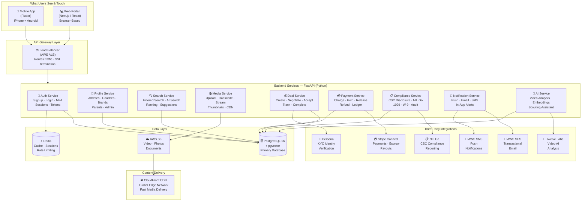

---

## Mobile App Architecture (Flutter)

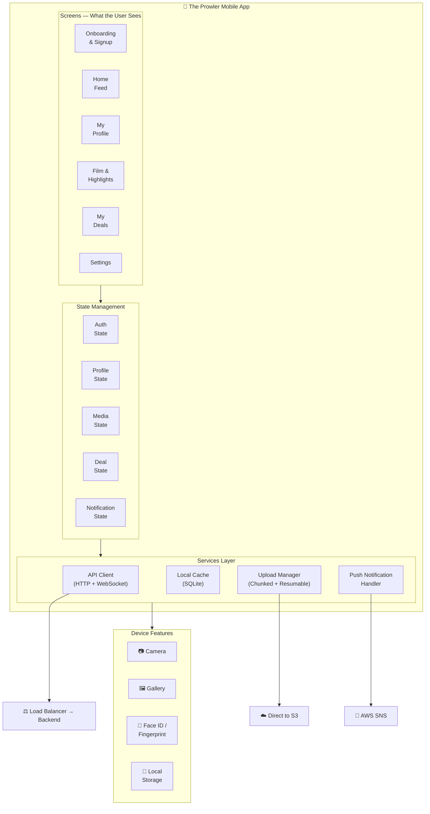

---

## Web Portal Architecture (Next.js)

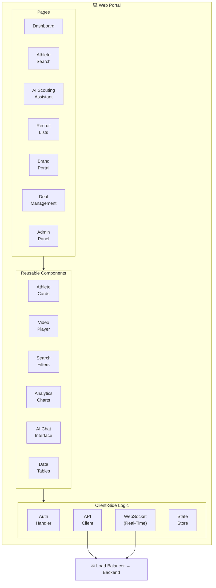

---

## Database Schema

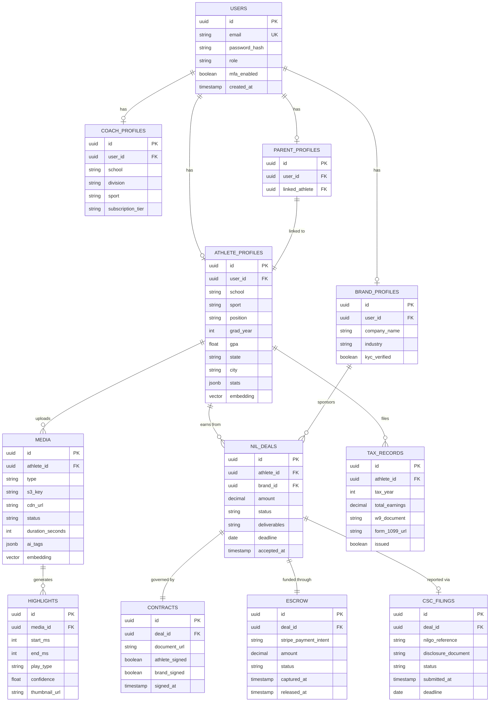

---

## Authentication & Security Flow

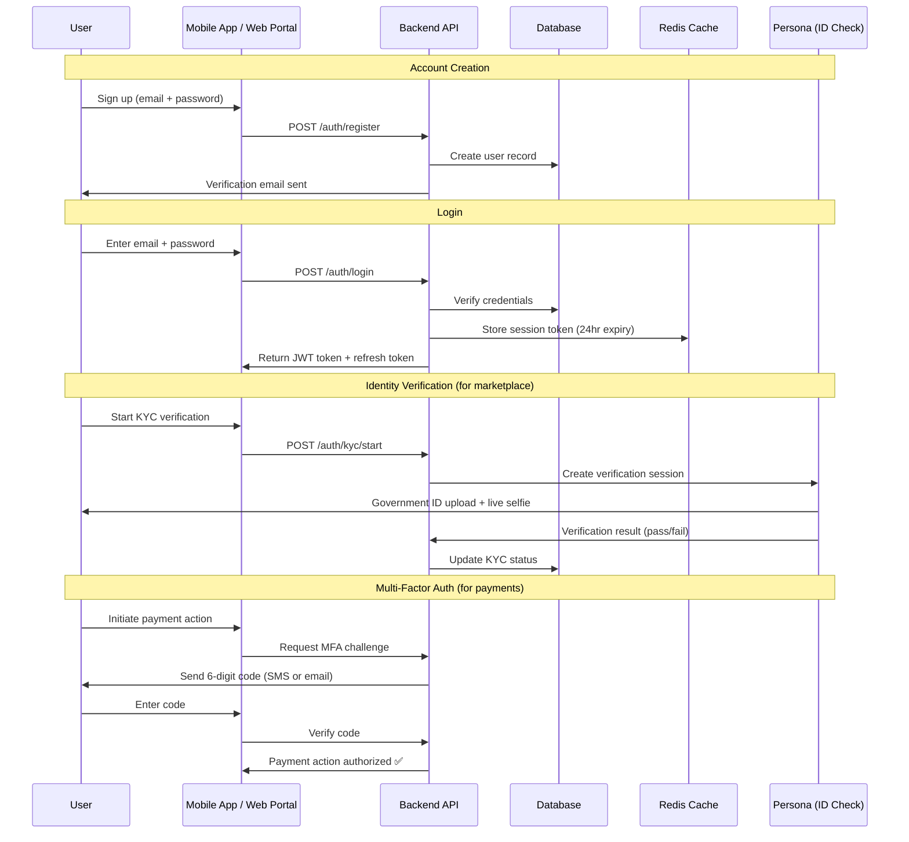

---

## Video Processing Pipeline

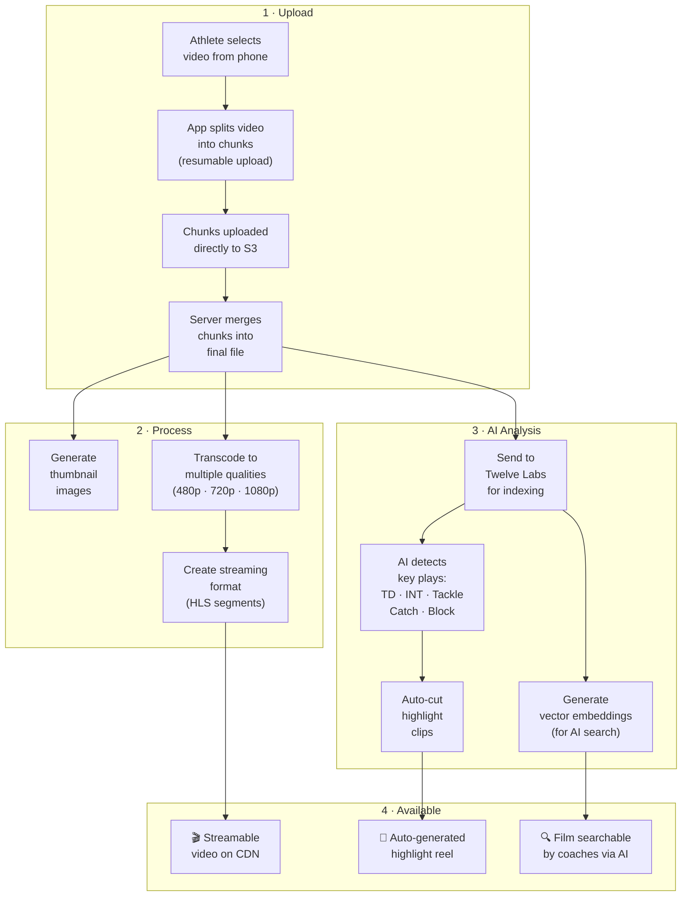

---

## AI Search Pipeline

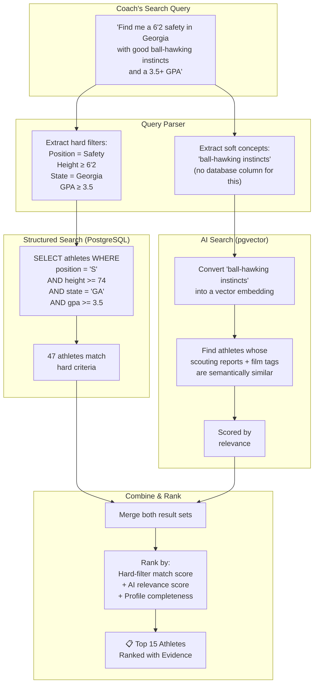

---

## NIL Deal Lifecycle

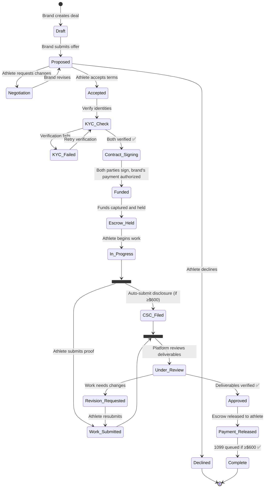

---

## Payment & Escrow Flow

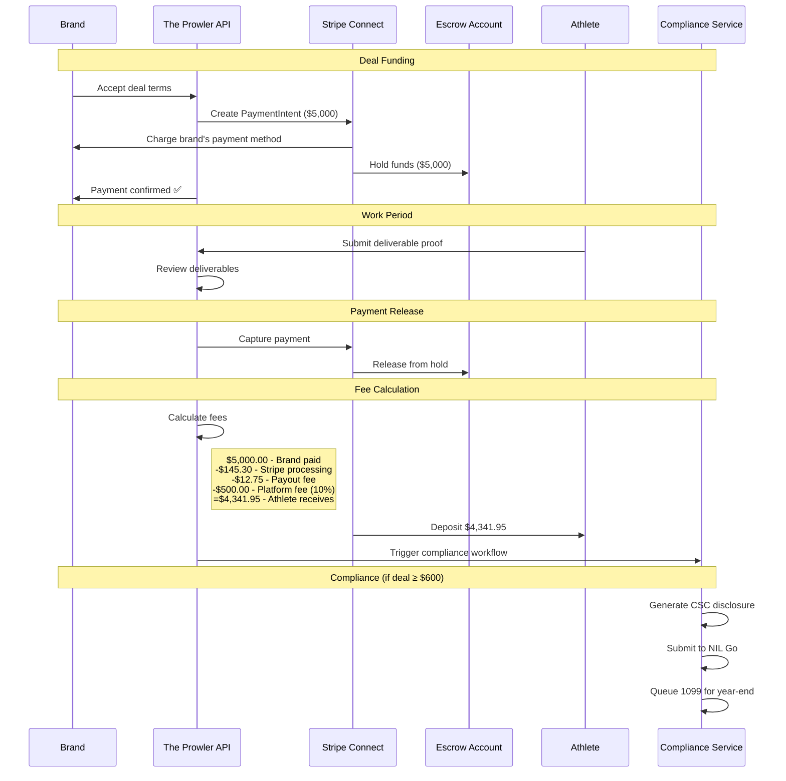

---

## Infrastructure & Deployment

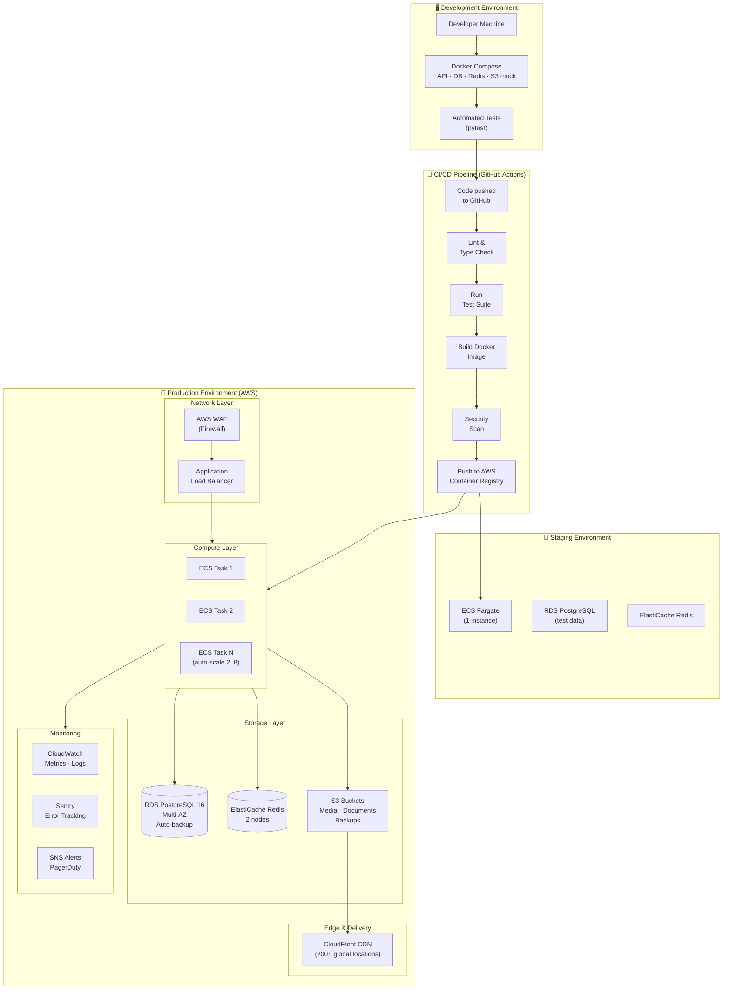

---

## Auto-Scaling Rules

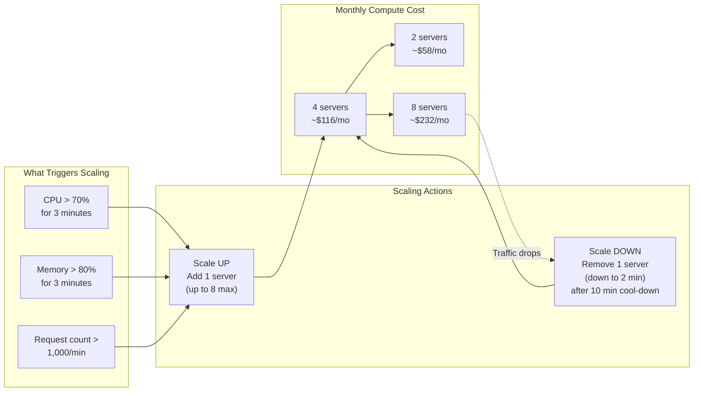

---

## Full Request Lifecycle

*What happens when a coach searches for an athlete — every system touched in order:*

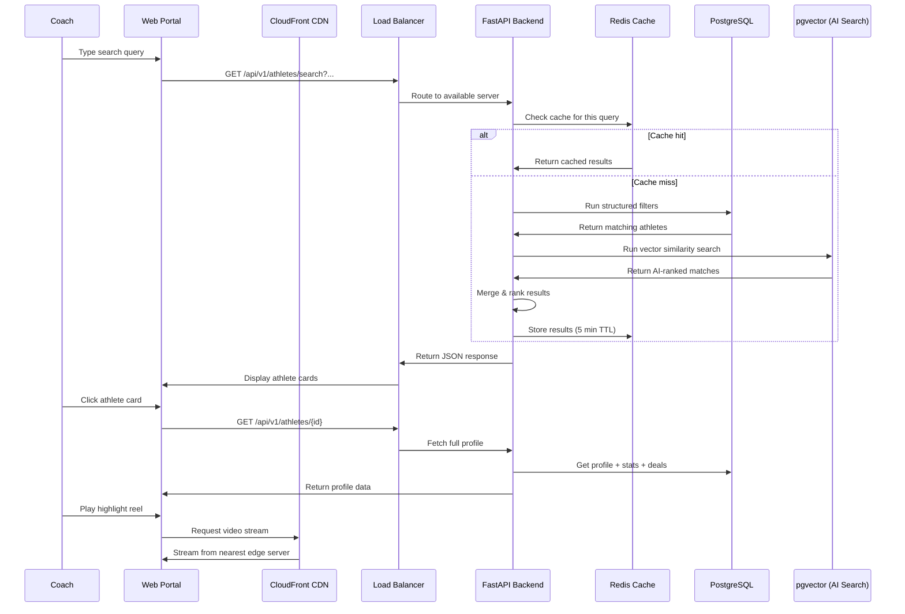

---

## Technology Stack Summary

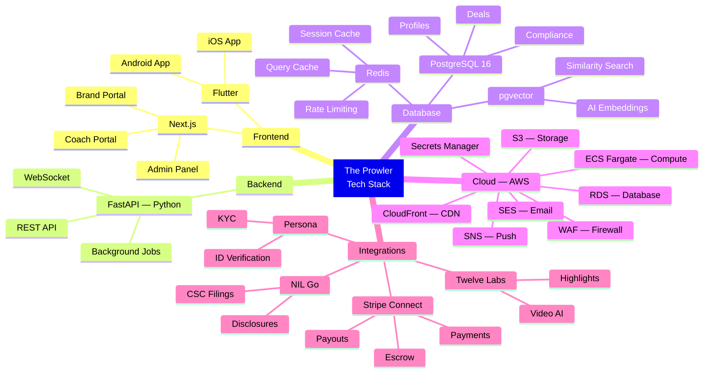

---

*Ben Hutton — Hutton Technologies — February 2026*
