# The Prowler — Technical Architecture

---

**Ben Hutton — Hutton Technologies**
**February 2026**

---

## System Overview

```mermaid
graph TB
    subgraph Clients["What Users See & Touch"]
        direction LR
        MOB["📱 Mobile App<br/>(Flutter)<br/>iPhone + Android"]
        WEB["💻 Web Portal<br/>(Next.js / React)<br/>Browser-Based"]
    end

    subgraph Gateway["API Gateway Layer"]
        LB["⚖️ Load Balancer<br/>(AWS ALB)<br/>Routes traffic · SSL termination"]
    end

    subgraph Backend["Backend Services — FastAPI (Python)"]
        direction TB
        AUTH["🔐 Auth Service<br/>Signup · Login · MFA<br/>Sessions · Tokens"]
        PROFILE["👤 Profile Service<br/>Athletes · Coaches · Brands<br/>Parents · Admin"]
        SEARCH["🔍 Search Service<br/>Filtered Search · AI Search<br/>Ranking · Suggestions"]
        MEDIA["🎬 Media Service<br/>Upload · Transcode · Stream<br/>Thumbnails · CDN"]
        DEAL["💰 Deal Service<br/>Create · Negotiate · Accept<br/>Track · Complete"]
        PAY["💳 Payment Service<br/>Charge · Hold · Release<br/>Refund · Ledger"]
        COMPLY["📋 Compliance Service<br/>CSC Disclosure · NIL Go<br/>1099 · W-9 · Audit"]
        NOTIFY["🔔 Notification Service<br/>Push · Email · SMS<br/>In-App Alerts"]
        AI["🧠 AI Service<br/>Video Analysis · Embeddings<br/>Scouting Assistant"]
    end

    subgraph Data["Data Layer"]
        direction LR
        PG[("🗄️ PostgreSQL 16<br/>+ pgvector<br/>Primary Database")]
        REDIS[("⚡ Redis<br/>Cache · Sessions<br/>Rate Limiting")]
        S3["☁️ AWS S3<br/>Video · Photos<br/>Documents"]
    end

    subgraph External["Third-Party Integrations"]
        direction LR
        STRIPE["💳 Stripe Connect<br/>Payments · Escrow<br/>Payouts"]
        PERSONA["🪪 Persona<br/>KYC Identity<br/>Verification"]
        TWELVE["🎥 Twelve Labs<br/>Video AI<br/>Analysis"]
        NILGO["📋 NIL Go<br/>CSC Compliance<br/>Reporting"]
        SES["📧 AWS SES<br/>Transactional<br/>Email"]
        SNS["📱 AWS SNS<br/>Push<br/>Notifications"]
    end

    subgraph Delivery["Content Delivery"]
        CDN["🌐 CloudFront CDN<br/>Global Edge Network<br/>Fast Media Delivery"]
    end

    MOB --> LB
    WEB --> LB
    LB --> Backend

    AUTH --> PG
    AUTH --> REDIS
    PROFILE --> PG
    SEARCH --> PG
    MEDIA --> S3
    DEAL --> PG
    PAY --> STRIPE
    PAY --> PG
    COMPLY --> NILGO
    COMPLY --> PG
    NOTIFY --> SES
    NOTIFY --> SNS
    AI --> TWELVE
    AI --> PG
    DEAL --> PERSONA

    S3 --> CDN
```

---

## Mobile App Architecture (Flutter)

```mermaid
graph TB
    subgraph App["📱 The Prowler Mobile App"]
        direction TB

        subgraph Screens["Screens — What the User Sees"]
            direction LR
            ONBOARD["Onboarding<br/>& Signup"]
            HOME["Home<br/>Feed"]
            PROF_S["My<br/>Profile"]
            FILM["Film &<br/>Highlights"]
            DEALS_S["My<br/>Deals"]
            SETTINGS["Settings"]
        end

        subgraph State["State Management"]
            direction LR
            AUTH_S["Auth<br/>State"]
            PROFILE_S["Profile<br/>State"]
            MEDIA_S["Media<br/>State"]
            DEAL_STATE["Deal<br/>State"]
            NOTIFY_S["Notification<br/>State"]
        end

        subgraph Services_M["Services Layer"]
            direction LR
            API_CLIENT["API Client<br/>(HTTP + WebSocket)"]
            CACHE_M["Local Cache<br/>(SQLite)"]
            UPLOAD["Upload Manager<br/>(Chunked + Resumable)"]
            PUSH["Push Notification<br/>Handler"]
        end
    end

    subgraph Phone["Device Features"]
        direction LR
        CAMERA["📷 Camera"]
        GALLERY["🖼️ Gallery"]
        BIOMETRIC["🔐 Face ID /<br/>Fingerprint"]
        STORAGE["💾 Local<br/>Storage"]
    end

    Screens --> State
    State --> Services_M
    API_CLIENT --> LB2["⚖️ Load Balancer → Backend"]
    UPLOAD --> S3_2["☁️ Direct to S3"]
    PUSH --> SNS_2["📱 AWS SNS"]
    Services_M --> Phone
```

---

## Web Portal Architecture (Next.js)

---

## Database Schema

---

## Authentication & Security Flow

---

## Video Processing Pipeline

```mermaid
flowchart TB
    subgraph Upload["1 · Upload"]
        USER_UP["Athlete selects<br/>video from phone"]
        CHUNK["App splits video<br/>into chunks<br/>(resumable upload)"]
        S3_UP["Chunks uploaded<br/>directly to S3"]
        MERGE["Server merges<br/>chunks into<br/>final file"]
    end

    subgraph Process["2 · Process"]
        THUMB["Generate<br/>thumbnail<br/>images"]
        TRANSCODE["Transcode to<br/>multiple qualities<br/>(480p · 720p · 1080p)"]
        HLS["Create streaming<br/>format<br/>(HLS segments)"]
    end

    subgraph AIAnalysis["3 · AI Analysis"]
        INDEX["Send to<br/>Twelve Labs<br/>for indexing"]
        DETECT["AI detects<br/>key plays:<br/>TD · INT · Tackle<br/>Catch · Block"]
        CLIP["Auto-cut<br/>highlight<br/>clips"]
        EMBED["Generate<br/>vector embeddings<br/>(for AI search)"]
    end

    subgraph Output["4 · Available"]
        STREAM["🎬 Streamable<br/>video on CDN"]
        HIGHLIGHTS_O["📱 Auto-generated<br/>highlight reel"]
        SEARCHABLE["🔍 Film searchable<br/>by coaches via AI"]
    end

    USER_UP --> CHUNK --> S3_UP --> MERGE
    MERGE --> THUMB & TRANSCODE
    TRANSCODE --> HLS
    MERGE --> INDEX --> DETECT --> CLIP
    INDEX --> EMBED

    HLS --> STREAM
    CLIP --> HIGHLIGHTS_O
    EMBED --> SEARCHABLE
```

---

## AI Search Pipeline

---

## NIL Deal Lifecycle

```mermaid
stateDiagram-v2
    [*] --> Draft: Brand creates deal
    Draft --> Proposed: Brand submits offer
    Proposed --> Negotiation: Athlete requests changes
    Negotiation --> Proposed: Brand revises
    Proposed --> Accepted: Athlete accepts terms
    Proposed --> Declined: Athlete declines

    Accepted --> KYC_Check: Verify identities
    KYC_Check --> KYC_Failed: Verification fails
    KYC_Failed --> KYC_Check: Retry verification
    KYC_Check --> Contract_Signing: Both verified ✅

    Contract_Signing --> Funded: Both parties sign, brand's payment authorized
    Funded --> Escrow_Held: Funds captured and held
    Escrow_Held --> In_Progress: Athlete begins work

    state compliance_fork <<fork>>
    In_Progress --> compliance_fork

    compliance_fork --> CSC_Filed: Auto-submit disclosure (if ≥$600)
    compliance_fork --> Work_Submitted: Athlete submits proof

    state compliance_join <<join>>
    CSC_Filed --> compliance_join
    Work_Submitted --> compliance_join

    compliance_join --> Under_Review: Platform reviews deliverables
    Under_Review --> Revision_Requested: Work needs changes
    Revision_Requested --> Work_Submitted: Athlete resubmits

    Under_Review --> Approved: Deliverables verified ✅
    Approved --> Payment_Released: Escrow released to athlete
    Payment_Released --> Complete: 1099 queued if ≥$600 ✅

    Declined --> [*]
    Complete --> [*]
```

---

## Payment & Escrow Flow

```mermaid
sequenceDiagram
    participant Brand
    participant API as The Prowler API
    participant Stripe as Stripe Connect
    participant Escrow as Escrow Account
    participant Athlete
    participant Comply as Compliance Service

    Note over Brand,Comply: Deal Funding
    Brand->>API: Accept deal terms
    API->>Stripe: Create PaymentIntent ($5,000)
    Stripe->>Brand: Charge brand's payment method
    Stripe->>Escrow: Hold funds ($5,000)
    API->>Brand: Payment confirmed ✅

    Note over Brand,Comply: Work Period
    Athlete->>API: Submit deliverable proof
    API->>API: Review deliverables

    Note over Brand,Comply: Payment Release
    API->>Stripe: Capture payment
    Stripe->>Escrow: Release from hold

    Note over Brand,Comply: Fee Calculation
    API->>API: Calculate fees
    Note right of API: $5,000.00 - Brand paid<br/>-$145.30 - Stripe processing<br/>-$12.75 - Payout fee<br/>-$500.00 - Platform fee (10%)<br/>=$4,341.95 - Athlete receives

    Stripe->>Athlete: Deposit $4,341.95
    API->>Comply: Trigger compliance workflow

    Note over Brand,Comply: Compliance (if deal ≥ $600)
    Comply->>Comply: Generate CSC disclosure
    Comply->>Comply: Submit to NIL Go
    Comply->>Comply: Queue 1099 for year-end
```

---

## Infrastructure & Deployment

```mermaid
graph TB
    subgraph Development["🖥️ Development Environment"]
        DEV_MACHINE["Developer Machine"]
        DOCKER["Docker Compose<br/>API · DB · Redis · S3 mock"]
        TESTS["Automated Tests<br/>(pytest)"]
    end

    subgraph CICD["🔄 CI/CD Pipeline (GitHub Actions)"]
        PUSH["Code pushed<br/>to GitHub"]
        LINT["Lint &<br/>Type Check"]
        TEST["Run<br/>Test Suite"]
        BUILD["Build Docker<br/>Image"]
        SCAN["Security<br/>Scan"]
        ECR["Push to AWS<br/>Container Registry"]
    end

    subgraph Staging["🧪 Staging Environment"]
        S_ECS["ECS Fargate<br/>(1 instance)"]
        S_RDS["RDS PostgreSQL<br/>(test data)"]
        S_REDIS["ElastiCache Redis"]
    end

    subgraph Production["🚀 Production Environment (AWS)"]

        subgraph Network["Network Layer"]
            WAF["AWS WAF<br/>(Firewall)"]
            ALB_P["Application<br/>Load Balancer"]
        end

        subgraph Compute["Compute Layer"]
            ECS_1["ECS Task 1"]
            ECS_2["ECS Task 2"]
            ECS_N["ECS Task N<br/>(auto-scale 2–8)"]
        end

        subgraph Storage["Storage Layer"]
            RDS_P[("RDS PostgreSQL 16<br/>Multi-AZ<br/>Auto-backup")]
            REDIS_P[("ElastiCache Redis<br/>2 nodes")]
            S3_P["S3 Buckets<br/>Media · Documents<br/>Backups"]
        end

        subgraph Edge["Edge & Delivery"]
            CF["CloudFront CDN<br/>(200+ global locations)"]
        end

        subgraph Monitoring["Monitoring"]
            CW["CloudWatch<br/>Metrics · Logs"]
            SENTRY["Sentry<br/>Error Tracking"]
            ALERTS["SNS Alerts<br/>PagerDuty"]
        end
    end

    DEV_MACHINE --> DOCKER
    DOCKER --> TESTS
    TESTS --> PUSH

    PUSH --> LINT --> TEST --> BUILD --> SCAN --> ECR

    ECR --> S_ECS
    ECR --> Compute

    WAF --> ALB_P --> Compute
    Compute --> RDS_P
    Compute --> REDIS_P
    Compute --> S3_P
    S3_P --> CF

    Compute --> Monitoring
```

---

## Auto-Scaling Rules

---

## Full Request Lifecycle

*What happens when a coach searches for an athlete — every system touched in order:*

---

## Technology Stack Summary

```mermaid
mindmap
    root["The Prowler<br/>Tech Stack"]
        Frontend
            Flutter
                iOS App
                Android App
            Next.js
                Coach Portal
                Brand Portal
                Admin Panel
        Backend
            FastAPI — Python
                REST API
                WebSocket
                Background Jobs
        Database
            PostgreSQL 16
                Profiles
                Deals
                Compliance
            pgvector
                AI Embeddings
                Similarity Search
            Redis
                Session Cache
                Query Cache
                Rate Limiting
        Cloud — AWS
            ECS Fargate — Compute
            RDS — Database
            S3 — Storage
            CloudFront — CDN
            SES — Email
            SNS — Push
            Secrets Manager
            WAF — Firewall
        Integrations
            Stripe Connect
                Payments
                Escrow
                Payouts
            Persona
                KYC
                ID Verification
            Twelve Labs
                Video AI
                Highlights
            NIL Go
                CSC Filings
                Disclosures
```

---

*Ben Hutton — Hutton Technologies — February 2026*
