# The Prowler
### A Technical Strategy by Ben Hutton — Hutton Technologies
**For:** Preston Pritchard, Founder
**Date:** February 7, 2026

---

## What Are We Building?

One sentence: **The platform where athletes get discovered and get paid.**

No one has built a single system that handles recruiting *and* NIL deals. Every competitor solves one piece. We solve all of them.

```mermaid
graph LR
    A["🏈 Athlete"] --> P["The Prowler"]
    C["🎓 Coach"] --> P
    B["💰 Brand"] --> P
    PR["👪 Parent"] --> P
    P --> D["Discovery"]
    P --> N["NIL Deals"]
    P --> M["Media & Highlights"]
    P --> CO["Compliance"]
```

---

## Why Now?

The NIL market isn't speculative — it's a **$2.75 billion ecosystem** that doubled in the last year. Three things changed the game:

| Event | Impact |
|---|---|
| **House v. NCAA Settlement** (June 2025) | Schools can now share ~$20M/year directly with athletes. The old amateur model is dead. |
| **College Sports Commission** (July 2025) | New independent body enforcing NIL compliance. All deals ≥$600 must be reported within 5 days or athletes lose eligibility. |
| **NCAA Recruiting Ban Lifted** | NIL compensation is now legal during recruitment. The Wild West needs a sheriff. |

> The compliance angle is the moat. Athletes who screw up reporting lose eligibility. A platform that automates this isn't optional — it's insurance.

---

## The Competition — And Where They Fall Short

| Platform | What They Do | What They Don't |
|---|---|---|
| **Opendorse** | Best NIL deal lifecycle | No recruiting. No athlete discovery for coaches. |
| **MOGL** | AI brand-matching | No scouting tools. Can't search by stats. |
| **INFLCR** | Brand management for schools | School-contracted. Athletes don't own their profile. |
| **Stack Athlete** | Recruiting profiles | Basic templates. No NIL, no marketplace, no AI. |
| **SportsRecruits** | Recruiting communication | Legacy tech. No video intelligence. |

**The gap:** Nobody combines AI-powered scouting + compliant NIL marketplace + athlete-owned media. That's us.

---

## How It Works — The Architecture

Think of it as a brain with multiple faces. One backend serves everything — mobile, web, admin — through a single API. Data is never out of sync.

```mermaid
graph TB
    subgraph Faces["What Users See"]
        MOB["📱 Flutter Mobile App<br/>Athletes & Parents"]
        WEB["💻 Next.js Web App<br/>Coaches, Scouts & Brands"]
    end

    subgraph Brain["The Backend Brain — FastAPI"]
        AUTH["🔐 Auth & Identity"]
        PROF["👤 Profiles & Stats"]
        MEDIA["🎬 Media & Video AI"]
        MARKET["💰 NIL Marketplace"]
        SCOUT["🔍 Scouting Engine"]
        COMPLY["📋 Compliance Engine"]
    end

    subgraph Foundation["Data & Infrastructure"]
        DB["🗄️ PostgreSQL<br/>All Data + Vector Search"]
        CACHE["⚡ Redis<br/>Speed Layer"]
        STORE["☁️ AWS S3<br/>Video & Media Files"]
        CDN["🌐 CloudFront CDN<br/>Fast Delivery"]
    end

    MOB --> Brain
    WEB --> Brain
    Brain --> Foundation
```

### Why These Technologies?

| Choice | Why | Alternative Considered |
|---|---|---|
| **FastAPI (Python)** | Matches Node.js speed + plugs directly into AI/ML libraries. Pydantic V2 enforces strict data types on every contract and payment. | Node.js — no native ML. Go — no ML ecosystem. |
| **Flutter (Mobile)** | One codebase → iOS + Android. Saves 30-40% dev cost. Impeller engine handles highlight video at 120fps. | React Native — viable, but Flutter's compiled ARM code is faster for video-heavy feeds. |
| **Next.js (Web)** | Server-side rendering for SEO on public profiles. Fast dashboards for coaches. | SvelteKit — smaller ecosystem, harder to hire for. |
| **PostgreSQL + pgvector** | One database for everything — relational data, vector search for AI, full-text search. 75% cheaper than running Pinecone separately. | 3 separate databases — over-engineered for our scale. |

---

## The User Journey

### For Athletes

```mermaid
flowchart LR
    A["Sign Up"] --> B["Build Profile<br/>Stats, Bio, School"]
    B --> C["Upload Film<br/>& Highlights"]
    C --> D["AI Auto-Cuts<br/>Best Plays"]
    D --> E["Get Discovered<br/>by Coaches"]
    E --> F["Receive NIL<br/>Deal Offers"]
    F --> G["Get Paid 💰<br/>Stay Compliant ✅"]
```

### For Coaches & Scouts

### For Brands

---

## NIL Compliance — The Differentiator

This is what protects athletes. No one else automates this end-to-end.

```mermaid
flowchart TB
    A["Deal Created"] --> B["Value ≥ $600?"]
    B -- Yes --> C["🤖 Auto-Generate<br/>CSC Disclosure"]
    B -- No --> D["Log Internally"]
    C --> E["📤 Submit to NIL Go<br/>Within 5 Business Days"]
    E --> F["CSC Reviews"]
    F -- Approved --> G["✅ Escrow Released<br/>Athlete Paid"]
    F -- Flagged --> H["⚠️ Compliance Team<br/>Investigates"]
    D --> G

    style C fill:#2d6a4f,color:#fff
    style E fill:#2d6a4f,color:#fff
    style G fill:#1b4332,color:#fff
```

### What We Automate

| Requirement | Who Requires It | What We Do |
|---|---|---|
| Report deals ≥$600 within 5 days | College Sports Commission | Auto-submit to NIL Go portal |
| KYC identity verification | Federal / State law | Persona verifies every athlete and brand on signup |
| Escrow until deliverables met | Platform policy | Stripe Connect holds funds, releases on verification |
| 1099-NEC tax forms for deals >$600 | IRS | Auto-generated at fiscal year-end |
| W-9 collection before payment | IRS | Required during onboarding, stored encrypted |

---

## Data Model — What We Store

### Who Can Do What

| Action | Athlete | Parent | Coach | Scout | Brand | Admin |
|:---|:---:|:---:|:---:|:---:|:---:|:---:|
| Edit own profile | ✅ | — | ✅ | ✅ | ✅ | ✅ |
| View child's data | — | ✅ | — | — | — | ✅ |
| Search athletes | — | — | ✅ | ✅ | ✅ | ✅ |
| Upload media | ✅ | — | — | — | — | ✅ |
| Create NIL deal | — | — | — | — | ✅ | ✅ |
| Accept NIL deal | ✅ | — | — | — | — | ✅ |
| View deal analytics | ✅ | ✅* | — | — | ✅ | ✅ |

*\*Parent sees child's deals only if linked and child is a minor*

---

## The Money Side

### How The Prowler Makes Money

| Revenue Stream | Price Point | When It Starts |
|---|---|---|
| **NIL Transaction Fees** | 8-12% per deal | Phase 3 (Month 9) |
| **Coach Subscriptions** | $49 - $199/mo | Phase 2 (Month 5) |
| **Enterprise Licenses** | $5K - $25K/yr per school | Phase 4 (Month 15) |
| **Premium Athlete Tools** | $9.99/mo | Phase 2 (Month 5) |

### Platform Operating Costs

| Item | Monthly Cost | Notes |
|---|---|---|
| **AWS Infrastructure** | $500 → $3,000 | Scales with users. ECS Fargate + RDS + S3 |
| **Stripe Connect** | 2.9% + $0.30/txn | Standard processing. We pass this to the buyer. |
| **Persona KYC** | $2 - $5/verification | One-time per user. ~$5K for first 1,000 athletes |
| **Twelve Labs Video AI** | ~$7.50/game film | Phase 2 only. ~$378K/season at 10K athletes |
| **Domain + SSL + Email** | ~$50 | Fixed |
| **Sentry (Error Tracking)** | $26 | Developer plan |
| **GitHub (CI/CD)** | $0 | Free for our scale |

### Video AI Cost Breakdown

This is the biggest variable cost. Here's how it scales:

| Scale | Athletes | Games/Season | Cost/Game | Seasonal Cost |
|---|---|---|---|---|
| **MVP (Phase 2 launch)** | 500 | 2,500 | $7.50 | **$18,750** |
| **Growth** | 5,000 | 25,000 | $7.50 | **$187,500** |
| **Scale** | 10,000 | 50,000 | $7.50 | **$375,000** |

> Video AI is Phase 2 budget. Phase 1 costs are just infrastructure — under $1K/month.

---

## Development Cost Estimate

| Phase | Duration | Effort | Estimated Cost* |
|---|---|---|---|
| **Phase 1:** Foundation | 4 months | Backend + Mobile + Web MVP | $40K - $60K |
| **Phase 2:** Intelligence | 4 months | AI pipeline + Advanced features | $50K - $75K |
| **Phase 3:** Marketplace | 5 months | NIL deals + Payments + Compliance | $60K - $90K |
| **Phase 4:** National Scale | 9 months | Partnerships + Enterprise | $80K - $120K |
| **Total** | **~22 months** | | **$230K - $345K** |

*\*Based on 1-2 developers. Scales down if we split dev work efficiently.*

---

## The Roadmap

```mermaid
gantt
    title The Prowler — Delivery Timeline
    dateFormat YYYY-MM
    axisFormat %b %Y

    section Phase 1: Foundation
        Backend API scaffold          :2026-03, 1M
        Database schema + auth        :2026-03, 1M
        Flutter mobile MVP            :2026-04, 2M
        Coach web portal              :2026-04, 2M
        CI/CD + staging deploy        :2026-05, 1M
        Target: 1K athletes           :milestone, 2026-06, 0d

    section Phase 2: Intelligence
        Video AI integration          :2026-07, 2M
        AI scouting co-pilot          :2026-07, 3M
        Advanced profiles             :2026-08, 2M
        Subscriptions launch          :2026-09, 1M
        Target: 10K athletes          :milestone, 2026-10, 0d

    section Phase 3: Marketplace
        NIL deal workflow             :2026-11, 2M
        Stripe Connect + escrow       :2026-11, 2M
        KYC + identity                :2026-12, 1M
        CSC/NIL Go automation         :2027-01, 2M
        Contract system               :2027-01, 2M
        Target: 500 deals/month       :milestone, 2027-03, 0d

    section Phase 4: National Scale
        Data partnerships             :2027-04, 3M
        Enterprise tier               :2027-04, 3M
        Advanced analytics            :2027-07, 3M
        Media integrations            :2027-07, 3M
        Target: 100K athletes         :milestone, 2027-12, 0d
```

---

## Phase 1 — What We Build First

Everything starts with one question: **Can an athlete build a profile that a coach actually wants to see?**

Phase 1 answers that question. No AI. No payments. Just the core loop.

```mermaid
flowchart LR
    A["Athlete Creates<br/>Profile"] --> B["Uploads Stats<br/>& Film"]
    B --> C["Coach Searches<br/>by Sport/Position/Location"]
    C --> D["Coach Finds<br/>Athlete"]
    D --> E["Core Loop<br/>Proven ✅"]

    style E fill:#1b4332,color:#fff
```

### Phase 1 Deliverables

| Component | What Gets Built |
|---|---|
| **FastAPI Backend** | Auth, profiles, search, media upload APIs |
| **PostgreSQL** | Users, athlete/coach profiles, sport stats, media |
| **Flutter Mobile** | Signup, profile builder, media upload, basic feed |
| **Next.js Web** | Coach search, athlete cards, saved recruit lists |
| **Auth System** | Login, social sign-in (Google/Apple), JWT tokens |
| **Infrastructure** | Docker → GitHub Actions → AWS ECS (staging) |

### Phase 1 Monthly Costs

| Item | Cost |
|---|---|
| AWS (ECS + RDS + S3) | ~$500 |
| Domain + SSL | ~$50 |
| Monitoring (Sentry) | $26 |
| **Total** | **~$576/month** |

---

## Infrastructure

---

## Security & Trust

Preston's CMMC background is directly relevant here. We apply the same rigor:

| Layer | Implementation |
|---|---|
| **Authentication** | OAuth2 + JWT, 15-min token expiry, refresh rotation |
| **MFA** | Required for all NIL transactions (TOTP — Google Authenticator) |
| **Data Encryption** | AES-256 at rest, TLS 1.3 in transit |
| **KYC/Identity** | Persona — Gov ID + selfie liveness for every marketplace participant |
| **Financial Data** | PCI-compliant via Stripe (we never touch card numbers) |
| **Audit Trail** | Every deal, disclosure, and payment logged immutably |
| **RBAC** | Role-based access — 6 distinct permission levels |

---

## Next Steps

1. **You review this document** — Tell me what questions Preston would ask. I'll have answers ready.
2. **I initialize the repo** — Project structure, Docker setup, database schema, API skeleton.
3. **We ship Phase 1** — Athlete profile → Coach search → Core loop proven.
4. **We iterate** — Each phase builds on proven infrastructure. No throwaway work.

---

*Built by Hutton Technologies. Let's go.*
