# The Prowler — Technical Strategy & Architecture

**From:** Ben Hutton, Hutton Technologies
**For:** Preston Pritchard
**Date:** February 2026

---

## What Is The Prowler?

The Prowler is a platform where high school and college athletes manage their entire sports career in one place — from getting discovered by college coaches to landing paid brand deals — without ever worrying about the legal paperwork that could cost them their eligibility.

Think of it as **LinkedIn meets Etsy, built specifically for athletes.**

- **LinkedIn for athletes:** Athletes build a professional profile with their stats, game film, and highlights. Coaches and scouts search for talent the same way a recruiter searches LinkedIn for job candidates.
- **Etsy for brand deals:** Brands browse athletes and offer them paid sponsorship deals (called NIL deals — more on that below). The platform handles the money, the contracts, and the compliance.

---

## Why This Matters Right Now

College sports just went through a complete overhaul. Here's the short version:

**Before 2021,** college athletes couldn't make a single dollar from their name, face, or fame. A quarterback with 500,000 Instagram followers couldn't accept $200 from a local restaurant to post about them. The NCAA would strip their eligibility — meaning they couldn't play.

**In July 2021,** the NCAA changed the rules. Athletes can now profit from what's called their **NIL** — their **Name, Image, and Likeness.** That means endorsement deals, social media sponsorships, paid appearances, merchandise — all fair game. This created an entirely new market overnight.

**In June 2025,** a massive lawsuit called **House v. NCAA** was settled. This changed everything again. Now schools can directly share up to about **$20 million per year** of their revenue with athletes. The old "amateur athlete" model is officially dead.

**In July 2025,** a new independent organization called the **College Sports Commission (CSC)** launched. Think of them as the referees for NIL deals — they enforce the rules and have the authority to declare athletes ineligible if they don't follow proper procedure.

The CSC created an online reporting system called **NIL Go** where athletes are required to disclose their NIL deals.

**Here's the critical part:** Any NIL deal worth **$600 or more** must be reported through NIL Go within **5 business days** of the deal being finalized. If an athlete misses that deadline, they risk losing their eligibility to play.

These are 18-22 year old kids juggling school, practice, games, and now — running what amounts to a small business. They're forgetting to file paperwork. They're losing eligibility over administrative mistakes.

**That's the problem we solve.**

---

## What's Available Today (And Why It's Not Enough)

A handful of platforms exist in this space. I researched every major one. Here's what each does and, more importantly, what each one misses:

| Platform | What They Do | What They're Missing |
|---|---|---|
| **Opendorse** | The biggest NIL deal platform. Helps athletes find brand partnerships, manage contracts, and get paid. | No recruiting tools at all. A college coach can't go on Opendorse and search for a player to recruit. It only helps athletes who already have deals. |
| **INFLCR** (owned by Teamworks) | A brand management tool for athletic departments. Schools pay for it and use it to manage their current athletes' media and brand activities. | The school controls the athlete's profile — the athlete doesn't own it. And there's no marketplace for recruiting or brand deals. |
| **MOGL** | An AI-powered platform that automatically matches athletes with brands for sponsorship campaigns. | No tools for coaches or scouts. A coach can't search by stats, position, or location. It only handles the brand-to-athlete matching piece. |
| **Stack Athlete** (formerly CaptainU) | A recruiting profile builder. Athletes create a profile page with their stats and film, then share a link with coaches. | No NIL deals, no marketplace, no AI, no compliance. It's essentially a website builder for athletes. |
| **SportsRecruits** | A communication tool for recruiting — athletes and coaches can message each other. | Old technology. No video analysis, no AI-powered search, no NIL features whatsoever. |

**The gap:** No single platform combines recruiting and discovery tools for coaches with an NIL marketplace for brands and compliance automation for athletes. Each platform only handles one piece. An athlete would need accounts on 4-5 different services to cover everything.

**The Prowler fills the entire gap in one product.**

---

## How The Prowler Works — User by User

### What Athletes Experience

```mermaid
flowchart LR
    A["📱 Download App<br/>(iPhone or Android)"] --> B["Create Profile<br/>Stats · Bio · School · Position"]
    B --> C["Upload Game Film"]
    C --> D["AI Automatically<br/>Cuts Highlight Clips"]
    D --> E["Coaches & Scouts<br/>Discover You"]
    E --> F["Brands<br/>Offer You Deals"]
    F --> G["Get Paid 💰<br/>Stay Eligible ✅"]

    style G fill:#1b4332,color:#fff
```

1. Athlete downloads the app on their phone
2. They build a profile — name, school, sport, position, stats, GPA, location
3. They upload game film (full games or individual clips)
4. Our AI (powered by a video analysis service called Twelve Labs) watches the film and automatically identifies the best plays — highlights are cut without the athlete doing any editing
5. Coaches and scouts find them through search or through an AI assistant that lets coaches just describe what they're looking for in plain language
6. Brands can browse athlete profiles and create sponsorship deal offers
7. When a deal happens, the platform handles the payment (held safely until the athlete completes the work) and automatically files all required compliance paperwork

**The athlete never has to think about CSC disclosures, tax forms, or deadlines. The platform handles it all.**

### What Coaches and Scouts Experience

```mermaid
flowchart LR
    A["💻 Log In<br/>(Web Portal)"] --> B["Search by Criteria<br/>Sport · Position · Location · Stats"]
    B --> C["Or Ask the AI:<br/>'Find me a left-handed<br/>pitcher in the Southeast<br/>with ERA under 3.0'"]
    C --> D["Review Profiles<br/>Watch Film · Compare Stats"]
    D --> E["Save to<br/>Recruit Lists"]
    E --> F["Contact Athletes"]
```

Coaches and scouts access the platform through a web portal (browser-based — no app needed). They can:
- Search by specific criteria like sport, position, location, graduation year, and stats
- Use an AI-powered assistant where they type a natural language question and get ranked results
- Watch highlight reels and full game film
- Save athletes to custom recruit lists
- Reach out to athletes directly

Coaches pay a monthly subscription to access these tools.

### What Brands and Sponsors Experience

```mermaid
flowchart LR
    A["Create<br/>Brand Account"] --> B["Verify Identity"]
    B --> C["Browse Athletes<br/>by Sport · Reach · Location"]
    C --> D["Create Deal Offer<br/>'$2,000 for 3 Instagram posts'"]
    D --> E["Funds Held Safely<br/>Until Work Is Done"]
    E --> F["Athlete Completes<br/>the Work"]
    F --> G["Payment Released<br/>to Athlete"]
```

Brands create an account and verify their identity (required by law before any financial transactions can happen). They browse athletes, create deal offers with specific deliverables and dollar amounts, and the platform handles the rest — holding funds safely, verifying deliverables are met, and releasing payment.

---

## The Compliance Engine — Our Biggest Advantage

This is the feature that separates The Prowler from everything else on the market. No other platform automates the compliance process end-to-end.

When I say "compliance," I mean the legal requirements that athletes have to follow to keep their eligibility:

| Requirement | What It Means | Who Requires It | How We Handle It |
|---|---|---|---|
| **Report deals ≥$600 within 5 business days** | Every NIL deal worth $600+ must be submitted to the CSC through their NIL Go portal before the 5-day deadline | College Sports Commission | Platform auto-generates the disclosure and auto-submits it |
| **Identity verification before payments** | Before anyone can send or receive money on the platform, their identity must be verified with a government ID and a selfie | Federal and state law (called "Know Your Customer" or KYC) | Handled automatically during signup through a service called Persona |
| **W-9 tax form collection** | The IRS requires a taxpayer identification form from anyone who will receive payments as an independent contractor | IRS | Collected during onboarding, stored with encryption |
| **1099-NEC tax forms for payments over $600** | At the end of the tax year, anyone who received $600+ must get a 1099 tax form so they can file their taxes | IRS | Generated automatically at year-end |
| **Payment held until work is complete** | Protects both sides — the brand's money is safe until the athlete delivers, and the athlete knows the money is there | Platform policy | Funds are held in a secure holding account (called escrow) through our payment processor |

```mermaid
flowchart TB
    START["Brand Creates Deal"] --> ACCEPT["Athlete Accepts Terms"]
    ACCEPT --> CHECK{"Is the Deal<br/>$600 or More?"}

    CHECK -- Yes --> KYC["Verify Both Parties<br/>(Gov ID + Selfie Check)"]
    KYC --> ESCROW["Hold Payment<br/>in Secure Account"]
    ESCROW --> DISCLOSE["Auto-Generate<br/>CSC Disclosure Form"]
    DISCLOSE --> SUBMIT["Auto-Submit to<br/>NIL Go Portal<br/>(Within 5 Business Days)"]
    SUBMIT --> FULFILL["Athlete Completes<br/>the Work"]

    CHECK -- No --> ESCROW_S["Hold Payment<br/>in Secure Account"]
    ESCROW_S --> FULFILL

    FULFILL --> VERIFY["Platform Verifies<br/>Work Is Done"]
    VERIFY --> RELEASE["✅ Payment Released<br/>to Athlete"]
    RELEASE --> TAX{"Was Deal<br/>$600 or More?"}
    TAX -- Yes --> FORM["Queue 1099 Tax Form<br/>for Year-End"]
    TAX -- No --> DONE["✅ Complete"]
    FORM --> DONE

    style DISCLOSE fill:#2d6a4f,color:#fff
    style SUBMIT fill:#2d6a4f,color:#fff
    style RELEASE fill:#1b4332,color:#fff
```

**Why this matters so much:** Athletes are 18-22 year olds who are not financial professionals. They don't know what a CSC disclosure is. They don't know they need to file within 5 days. They're losing their eligibility over paperwork. The Prowler makes it impossible to miss a deadline because there's nothing for the athlete to remember — the platform does it automatically.

**This is our competitive advantage** — it's hard to build, it's legally complex, and once athletes depend on it, they won't leave. Every other platform requires athletes to handle their own compliance.

---

## How Money Flows Through The Platform

```mermaid
sequenceDiagram
    participant Brand
    participant Platform as The Prowler
    participant Stripe as Payment Processor<br/>(Stripe Connect)
    participant Athlete

    Brand->>Platform: Create deal ($5,000)
    Platform->>Stripe: Authorize payment
    Note over Platform: Money held securely<br/>until work is done
    Athlete->>Platform: Submit proof of completion
    Platform->>Platform: Verify deliverables ✅
    Platform->>Stripe: Process payment
    Note over Platform: We take 10% platform fee ($500)
    Stripe->>Athlete: Deposit to athlete's bank
    Platform->>Platform: File CSC disclosure if ≥$600
    Platform->>Platform: Queue 1099 if ≥$600
```

### Breakdown of a $1,000 Deal

| Line Item | Amount | Explanation |
|---|---|---|
| Brand pays | $1,000.00 | The full deal amount |
| Payment processing fee | -$29.30 | Stripe (our payment processor) charges 2.9% + $0.30 per transaction |
| Payout fee | -$2.75 | Stripe charges 0.25% + $0.25 to deposit money into a bank account |
| **Platform fee (our revenue)** | **-$100.00** | **We take 10% of every deal — this is our primary revenue** |
| **Athlete receives** | **$867.95** | Deposited directly into their bank account |

### Breakdown of a $5,000 Deal

| Line Item | Amount |
|---|---|
| Brand pays | $5,000.00 |
| Payment processing fee | -$145.30 |
| Payout fee | -$12.75 |
| **Platform fee (our revenue)** | **-$500.00** |
| **Athlete receives** | **$4,341.95** |

---

## The Technology — What's Under the Hood

I'm going to walk through the technical architecture so you can see what's actually being built and why each piece exists.

```mermaid
graph TB
    subgraph Users["What Users See & Touch"]
        MOB["📱 Mobile App<br/>(iPhone + Android)<br/>For Athletes & Parents"]
        WEB["💻 Web Portal<br/>(Browser-Based)<br/>For Coaches · Brands · Admin"]
    end

    subgraph Brain["The Backend — 'The Brain'<br/>(FastAPI — Python)"]
        AUTH["🔐 Accounts & Security"]
        PROF["👤 Profiles & Search"]
        MEDIA["🎬 Video & Media"]
        MARKET["💰 Deals & Payments"]
        COMPLY["📋 Compliance & Reporting"]
        NOTIFY["🔔 Notifications"]
    end

    subgraph Data["Data Storage"]
        PG[("Database<br/>(PostgreSQL)<br/>All platform data")]
        REDIS[("Cache<br/>(Redis)<br/>Fast lookups")]
        S3["☁️ Cloud Storage<br/>Video · Photos"]
        CDN["🌐 Content Delivery<br/>Fast worldwide access"]
    end

    subgraph External["Third-Party Services We Plug Into"]
        STRIPE["Stripe Connect<br/>Payments & Money Holding"]
        PERSONA["Persona<br/>Identity Verification"]
        TWELVE["Twelve Labs<br/>Video AI Analysis"]
        NILGO["NIL Go Portal<br/>CSC Compliance Reporting"]
    end

    MOB --> Brain
    WEB --> Brain
    Brain --> Data
    MARKET --> STRIPE
    MARKET --> PERSONA
    MEDIA --> TWELVE
    COMPLY --> NILGO
    S3 --> CDN
```

### Why Each Technology Was Chosen

| Component | Technology | Why This One |
|---|---|---|
| **Backend (the brain)** | FastAPI (Python) | High performance, handles thousands of requests per second. Python has the best AI and machine learning libraries — critical for our smart search and video analysis features. |
| **Mobile app** | Flutter | Write the app once, and it runs on both iPhone and Android — this saves 30-40% on development cost compared to building two separate apps. It compiles to native code, so it runs fast. |
| **Web portal** | Next.js (React) | The most popular web framework in the world. Fast loading, search-engine friendly (so athlete profiles can show up in Google results), and has the largest talent pool if we ever need to hire additional developers. |
| **Database** | PostgreSQL with pgvector | PostgreSQL is the most trusted database in the industry (used by Instagram, Spotify, the US government). The pgvector add-on lets us do AI-powered searches — coaches can search by meaning, not just keywords. One database instead of three, which saves significant cost. |
| **Payment processor** | Stripe Connect | Stripe is the biggest online payment processor (used by Amazon, Shopify, Lyft). Stripe Connect is their product specifically designed for marketplaces — it handles collecting money from brands, holding it safely, and paying it out to athletes. |
| **Identity verification** | Persona | Used by major financial platforms. Checks government IDs and does live selfie matching to verify someone is who they say they are. Required by law before we can process payments. |
| **Video AI** | Twelve Labs | Their AI can watch game film and understand what's happening — touchdowns, interceptions, tackles — then automatically cut highlight clips. No human editor needed. |

---

## AI-Powered Features

### How Video Processing Works

```mermaid
flowchart TB
    subgraph Upload["1. Athlete Uploads Film"]
        VID["📹 Raw Game Film"]
    end

    subgraph Process["2. AI Processes It"]
        STORE["Store video in cloud"]
        ANALYZE["Twelve Labs AI watches the film<br/>and identifies key plays"]
        TAG["Tags each play:<br/>Touchdowns · Tackles · Catches · Assists"]
        CLIP["Cuts individual highlight clips<br/>automatically"]
        INDEX["Makes everything searchable<br/>by coaches"]
    end

    subgraph Output["3. Two Outputs"]
        REEL["📱 Highlight Reel<br/>Ready to share on social media"]
        SEARCH["🔍 Searchable Film<br/>Coaches can find specific plays"]
    end

    VID --> STORE --> ANALYZE --> TAG --> CLIP --> REEL
    ANALYZE --> INDEX --> SEARCH
```

### How Smart Search Works

```mermaid
flowchart LR
    COACH["Coach types:<br/>'Find me a defensive back<br/>in Texas with<br/>a 4.4 forty-yard dash'"] --> PARSE["System breaks this into<br/>hard criteria + concepts"]
    PARSE --> FILTER["Search database for exact matches:<br/>Position: DB<br/>State: TX<br/>40-time: ≤ 4.4"]
    PARSE --> MEANING["Search AI index for<br/>conceptual matches:<br/>Similar scouting reports,<br/>related video tags"]
    FILTER --> MERGE["Combine & Rank<br/>Results"]
    MEANING --> MERGE
    MERGE --> RESULTS["📋 Ranked List of Athletes<br/>with Evidence & Film"]
```

> **An important note on data:** The AI features are only as good as the data behind them. In the early phases, data comes from athletes entering their own stats and uploading their own film. Down the road (Phase 3-4), we build partnerships with data providers like MaxPreps and Hudl to bring in verified stats and more comprehensive film libraries. The AI gets smarter as the data grows.

---

## Infrastructure — Where It All Runs

Everything runs on **Amazon Web Services (AWS)** — the same cloud infrastructure used by Netflix, Airbnb, and most of the tech industry. The platform auto-scales — it automatically adds more server capacity when traffic increases and scales back down when it's quiet, so we only pay for what we use.

---

## Verified Cost Breakdown

Every dollar figure below comes from published pricing pages and industry data as of February 2026.

### Monthly Infrastructure Costs

| Service | Phase 1 (MVP) | Phase 2 (Growth) | Phase 3+ (Scale) |
|---|---|---|---|
| Application servers (AWS Fargate) | $58 | $174 | $464 |
| Database (AWS RDS PostgreSQL) | $15 | $111 | $222 |
| Cache (AWS ElastiCache Redis) | $12 | $92 | $184 |
| Media storage (AWS S3) | $1 | $23 | $230 |
| Content delivery (AWS CloudFront) | $0 (free tier) | $15 | $200 |
| Domain, SSL, email | $50 | $50 | $50 |
| Error tracking (Sentry) | $26 | $26 | $80 |
| **TOTAL INFRASTRUCTURE** | **~$162/mo** | **~$491/mo** | **~$1,430/mo** |

### Third-Party Service Costs

| Service | How They Charge | Cost |
|---|---|---|
| **Stripe Connect** (payments) | 2.9% + $0.30 per transaction | Paid per transaction — only kicks in when deals happen |
| **Stripe payouts** | 0.25% + $0.25 per payout | Per payout to an athlete's bank account |
| **Persona** (identity verification) | $250/month base + $1.50 per verification over 500 | Starts when marketplace launches (Phase 3) |
| **Twelve Labs** (video AI) | $0.042 per minute of video indexed | Starts when video AI launches (Phase 2) |

### Video AI Costs at Scale

| Scale | Athletes | Games Analyzed | Video Minutes | Cost Per Season |
|---|---|---|---|---|
| Pilot (50 athletes) | 50 | 250 | 22,500 | ~$1,400 |
| Early growth (500) | 500 | 2,500 | 225,000 | ~$14,200 |
| Growth (5,000) | 5,000 | 25,000 | 2,250,000 | ~$141,800 |
| National scale (10,000) | 10,000 | 50,000 | 4,500,000 | ~$283,500 |

---

## Revenue Model — How The Prowler Makes Money

| Revenue Stream | Price | When It Launches |
|---|---|---|
| **NIL transaction fee** | 10% of every deal | Phase 3 |
| **Coach/Scout subscriptions** | $49 / $99 / $199 per month (tiered by features) | Phase 2 |
| **Premium athlete tools** | $9.99/month (advanced analytics, highlight editing) | Phase 2 |
| **Enterprise school licenses** | $5,000 – $25,000/year (bulk access for athletic departments) | Phase 4 |

### Revenue Scenarios

| Scenario | Monthly Revenue |
|---|---|
| 500 coach subscriptions @ $99/mo average | $49,500 |
| 100 NIL deals/month @ $1,500 average (10% fee) | $15,000 |
| 1,000 premium athlete subscriptions @ $9.99/mo | $9,990 |
| 5 enterprise school licenses @ $15K/year | $6,250 |
| **Combined** | **~$80,740/mo** |

---

## Security

| Layer | How It Works |
|---|---|
| **Account security** | Two-step login required for all financial transactions |
| **Identity verification** | Government ID + selfie check for all marketplace participants (via Persona) |
| **Data encryption** | All data encrypted when stored and when transmitted |
| **Payment security** | PCI-DSS compliant through Stripe — no credit card data ever touches our servers |
| **Audit trail** | Every deal, disclosure, payment, and status change is permanently logged |
| **Access control** | 6 distinct permission levels — athletes, parents, coaches, scouts, brands, and admins each see only what they should |

---

## Access Control — Who Can Do What

| Action | Athlete | Parent | Coach | Scout | Brand | Admin |
|:---|:---:|:---:|:---:|:---:|:---:|:---:|
| Edit own profile | ✅ | — | ✅ | ✅ | ✅ | ✅ |
| View child's data | — | ✅ | — | — | — | ✅ |
| Search for athletes | — | — | ✅ | ✅ | ✅ | ✅ |
| Upload game film | ✅ | — | — | — | — | ✅ |
| Create NIL deal offer | — | — | — | — | ✅ | ✅ |
| Accept NIL deal | ✅ | — | — | — | — | ✅ |
| View deal analytics | ✅ | ✅* | — | — | ✅ | ✅ |
| Manage platform settings | — | — | — | — | — | ✅ |

*\*Parent can see their child's deal data only if accounts are linked and the athlete is a minor*

---

## Development Timeline

---

## What Gets Built First

Everything starts with one question: **Can an athlete create a profile that a coach actually wants to look at?**

Phase 1 answers that question.

```mermaid
flowchart LR
    A["Athlete Creates<br/>Profile"] --> B["Uploads Stats<br/>& Film"]
    B --> C["Coach Searches<br/>by Sport · Position · Location"]
    C --> D["Coach Views<br/>Athlete Profile"]
    D --> E["Core Product<br/>Proven ✅"]

    style E fill:#1b4332,color:#fff
```

Phase 1 costs **$65,500** in development at market rate and **~$162/month** to run. That's the investment to prove the concept.

Everything after Phase 1 builds on the same foundation. No throwaway work — every feature, every database table, every security system carries forward into the later phases.

---

*Ben Hutton — Hutton Technologies — February 2026*
