# The Prowler

**Technical Architecture, Implementation Plan & Cost Analysis**

---

**From:** Ben Hutton — Hutton Technologies
**To:** Preston Pritchard
**Date:** February 7, 2026

---

## The Opportunity

The NIL market is a **$2.75 billion ecosystem** as of 2025. The *House v. NCAA* settlement finalized in June 2025 changed everything — schools can now share ~$20M/year with athletes directly. The College Sports Commission (CSC) launched in July 2025 with enforcement authority. NIL recruiting bans are permanently lifted.

No platform today combines **recruiting discovery**, **NIL deal management**, and **compliance automation** in one product. That's the gap.

```mermaid
graph LR
    subgraph Today["Today: Fragmented"]
        direction TB
        A["Stack Athlete<br/>Recruiting Profiles"]
        B["Opendorse<br/>NIL Deals"]
        C["MOGL<br/>AI Matching"]
        D["Manual<br/>Compliance"]
    end

    subgraph Tomorrow["The Prowler: Unified"]
        direction TB
        E["🏈 Discovery"]
        F["💰 NIL Marketplace"]
        G["🤖 AI Scouting"]
        H["📋 Auto Compliance"]
    end

    Today -->|"Gap"| Tomorrow
```

---

## Who We're Up Against

| Platform | What They Do | What They Miss |
|---|---|---|
| **Opendorse** | NIL deal lifecycle, tax guidance | Zero recruiting/discovery tools |
| **MOGL** | AI brand-to-athlete matching | No coach scouting, no stat search |
| **INFLCR** (Teamworks) | School-contracted brand mgmt | Athletes don't own their profile |
| **Stack Athlete** | Recruiting profile templates | No NIL, no marketplace, no AI |
| **SportsRecruits** | Recruiting communications | Legacy tech, no video intelligence |
| **PlayBooked, NOCAP, etc.** | Small niche NIL platforms | Limited features, no scale |

---

## The Product — What Each User Does

### Athlete Journey

```mermaid
flowchart LR
    A["📱 Sign Up<br/>(Mobile App)"] --> B["Build Profile<br/>Stats · Bio · School"]
    B --> C["Upload<br/>Game Film"]
    C --> D["AI Cuts<br/>Highlights"]
    D --> E["Coaches<br/>Discover You"]
    E --> F["Brands<br/>Offer Deals"]
    F --> G["Get Paid 💰<br/>Stay Eligible ✅"]

    style G fill:#1b4332,color:#fff
```

### Coach / Scout Journey

### Brand / Sponsor Journey

---

## System Architecture

One backend serves everything. Data is never out of sync between mobile and web.

```mermaid
graph TB
    subgraph Users["What Users See"]
        MOB["📱 Flutter Mobile<br/>iOS + Android<br/>Athletes · Parents"]
        WEB["💻 Next.js Web<br/>Coaches · Scouts · Brands · Admin"]
    end

    subgraph API["API Gateway"]
        GW["🔒 Rate Limiting · Auth · Routing"]
    end

    subgraph Services["FastAPI Backend Services"]
        AUTH["🔐 Auth<br/>OAuth2 + JWT"]
        PROF["👤 Profiles<br/>Athletes · Coaches · Scouts"]
        MEDIA["🎬 Media<br/>Upload · Transcode · AI"]
        MARKET["💰 NIL Marketplace<br/>Deals · Contracts · Escrow"]
        SEARCH["🔍 Scouting Engine<br/>Search · RAG · AI"]
        COMPLY["📋 Compliance<br/>CSC Reporting · Tax"]
        NOTIFY["🔔 Notifications<br/>Push · Email · SMS"]
    end

    subgraph Data["Data Layer"]
        PG[("PostgreSQL 16<br/>+ pgvector<br/>All Data")]
        REDIS[("Redis<br/>Cache · Sessions")]
        S3["☁️ S3<br/>Media Files"]
        CDN["🌐 CloudFront<br/>Video/Image CDN"]
    end

    subgraph External["External Services"]
        STRIPE["Stripe Connect<br/>Payments"]
        PERSONA["Persona<br/>KYC/Identity"]
        TWELVE["Twelve Labs<br/>Video AI"]
        NILGO["NIL Go Portal<br/>CSC Reporting"]
    end

    MOB --> GW
    WEB --> GW
    GW --> Services
    Services --> Data
    MARKET --> STRIPE
    MARKET --> PERSONA
    MEDIA --> TWELVE
    COMPLY --> NILGO
    S3 --> CDN
```

### Why Each Technology Was Chosen

---

## Data Architecture

### What We Store

### Core Tables

| Table | Records | Key Fields |
|---|---|---|
| `users` | All accounts | `id`, `email`, `role`, `kyc_status`, `mfa_enabled` |
| `athlete_profiles` | Athlete identity | `user_id`, `sport`, `position`, `school`, `grad_year`, `gpa`, `height`, `weight`, `location` |
| `sport_stats` | Performance data | `athlete_id`, `season`, `stat_key`, `stat_value`, `verified`, `source` |
| `media_items` | Video/Photo | `athlete_id`, `type`, `url`, `thumbnail_url`, `duration`, `embedding` (vector) |
| `nil_deals` | Marketplace deals | `athlete_id`, `brand_id`, `value`, `status`, `contract_id`, `escrow_id` |
| `contracts` | Legal terms | `deal_id`, `terms_hash`, `deliverables`, `deadline`, `signed_at` |
| `escrow_txns` | Payment holds | `deal_id`, `stripe_intent_id`, `amount`, `status`, `released_at` |
| `csc_disclosures` | Regulatory filings | `deal_id`, `nil_go_ref_id`, `reported_at`, `status` |

### Access Control — Who Can Do What

| Action | 🏈 Athlete | 👪 Parent | 🎓 Coach | 🔍 Scout | 💰 Brand | ⚙️ Admin |
|:---|:---:|:---:|:---:|:---:|:---:|:---:|
| Edit own profile | ✅ | — | ✅ | ✅ | ✅ | ✅ |
| View child's data | — | ✅ | — | — | — | ✅ |
| Search athletes | — | — | ✅ | ✅ | ✅ | ✅ |
| Upload media | ✅ | — | — | — | — | ✅ |
| Create NIL deal | — | — | — | — | ✅ | ✅ |
| Accept NIL deal | ✅ | — | — | — | — | ✅ |
| View deal analytics | ✅ | ✅* | — | — | ✅ | ✅ |
| Manage platform | — | — | — | — | — | ✅ |

*\*Parent sees child's analytics only if linked and athlete is a minor*

---

## NIL Compliance Engine

This is **the** differentiator. Athletes who fail to report deals lose eligibility. We automate the entire chain.

```mermaid
flowchart TB
    START["Brand Creates Deal"] --> ACCEPT["Athlete Accepts Terms"]
    ACCEPT --> CHECK{"Deal ≥ $600?"}

    CHECK -- Yes --> KYC["Verify Both Parties<br/>(Persona KYC)"]
    KYC --> ESCROW["Hold Funds in Escrow<br/>(Stripe Connect)"]
    ESCROW --> DISCLOSE["Auto-Generate<br/>CSC Disclosure"]
    DISCLOSE --> SUBMIT["Submit to NIL Go<br/>Within 5 Business Days"]
    SUBMIT --> REVIEW{"CSC Review"}
    REVIEW -- Approved --> FULFILL["Athlete Fulfills<br/>Deliverables"]
    REVIEW -- Flagged --> ALERT["⚠️ Compliance<br/>Team Notified"]

    CHECK -- No --> ESCROW_SMALL["Hold Funds<br/>(Stripe Connect)"]
    ESCROW_SMALL --> FULFILL

    FULFILL --> VERIFY["Platform Verifies<br/>Completion"]
    VERIFY --> RELEASE["✅ Payment Released<br/>to Athlete"]
    RELEASE --> TAX{"Deal ≥ $600?"}
    TAX -- Yes --> FORM["Queue 1099-NEC<br/>for Year-End"]
    TAX -- No --> DONE["✅ Complete"]
    FORM --> DONE

    style DISCLOSE fill:#2d6a4f,color:#fff
    style SUBMIT fill:#2d6a4f,color:#fff
    style RELEASE fill:#1b4332,color:#fff
```

### Compliance Requirements & How We Handle Them

| Requirement | Who Requires It | Our Implementation |
|---|---|---|
| Report deals ≥$600 within 5 business days | College Sports Commission | Auto-submit to NIL Go portal via API |
| Evaluate "valid business purpose" | NCAA Proposal 2025-25 | Deal metadata captures purpose, deliverables, rationale |
| KYC identity verification | Federal + State law | Persona: Gov ID + selfie + liveness check on signup |
| W-9 collection before any payment | IRS | Required during onboarding, stored AES-256 encrypted |
| 1099-NEC for payments >$600 | IRS | Auto-generated at fiscal year-end |
| Escrow until deliverables met | Platform policy (protects both parties) | Stripe Connect manual payouts + delayed capture |

---

## Payment Architecture

### Payment Flow Economics (per $1,000 deal)

| Line Item | Amount | Rate |
|---|---|---|
| Brand pays | $1,000.00 | — |
| Stripe processing fee | -$29.30 | 2.9% + $0.30 |
| Stripe payout fee | -$2.75 | 0.25% + $0.25 |
| **Platform fee (our revenue)** | **-$100.00** | **10%** |
| **Athlete receives** | **$867.95** | — |

---

## AI & Video Intelligence Pipeline

### How Video Processing Works

```mermaid
flowchart TB
    subgraph Upload["1. Athlete Uploads"]
        VID["📹 Game Film<br/>(Raw Video)"]
    end

    subgraph Process["2. AI Processing"]
        S3U["Store in S3"]
        TL["Twelve Labs Pegasus<br/>Analyze Video"]
        TAG["Extract Tags<br/>Touchdowns · Tackles · Catches"]
        CLIP["Cut Highlight Clips<br/>Auto-Generated"]
        EMB["Generate Embeddings<br/>(Sentence Transformers)"]
        PGV["Store in pgvector<br/>(Searchable)"]
    end

    subgraph Output["3. Results"]
        REEL["📱 Highlight Reel<br/>Auto-Cut, Social-Ready"]
        SEARCH["🔍 Searchable<br/>by Coaches via AI"]
    end

    VID --> S3U --> TL --> TAG --> CLIP --> REEL
    TL --> EMB --> PGV --> SEARCH
```

### Scouting Co-Pilot (RAG System)

```mermaid
flowchart LR
    COACH["Coach Types:<br/>'Find me left-handed<br/>pitchers in the SE<br/>with ERA under 3.0'"] --> PARSE["Parse Query<br/>into Filters + Semantics"]
    PARSE --> STRUCT["Structured Search<br/>PostgreSQL<br/>(Sport, Position, Location)"]
    PARSE --> VECTOR["Semantic Search<br/>pgvector<br/>(Scouting Reports, Video Tags)"]
    STRUCT --> MERGE["Merge & Rank<br/>Results"]
    VECTOR --> MERGE
    MERGE --> RESULTS["📋 Ranked Athletes<br/>with Evidence Cards"]
```

> **The hard truth about data:** The AI is only as good as the data it has. Phase 1 data comes from athletes entering their own stats and uploading their own film. Data partnerships (MaxPreps, Hudl, state athletic associations) don't come until Phase 3-4 after we have leverage.

---

## Infrastructure

```mermaid
graph TB
    subgraph Local["🖥️ Local Dev"]
        DOCKER["Docker Compose<br/>FastAPI + PostgreSQL + Redis"]
    end

    subgraph Pipeline["🔄 CI/CD Pipeline"]
        GIT["GitHub Push"]
        ACTIONS["GitHub Actions<br/>Lint → Test → Build → Deploy"]
        ECR["AWS ECR<br/>Container Registry"]
    end

    subgraph Staging["🧪 Staging"]
        S_ALB["ALB"]
        S_ECS["ECS Fargate<br/>1 task"]
        S_RDS["RDS db.t4g.micro<br/>Single-AZ"]
        S_REDIS["ElastiCache t4g.micro"]
    end

    subgraph Prod["🚀 Production"]
        P_ALB["Application<br/>Load Balancer"]
        P_ECS["ECS Fargate<br/>Auto-Scaling<br/>2-8 tasks"]
        P_RDS["RDS db.m6g.large<br/>Multi-AZ"]
        P_REDIS["ElastiCache<br/>m6g.large"]
        P_S3["S3<br/>Media Storage"]
        P_CDN["CloudFront CDN"]
    end

    Local --> GIT --> ACTIONS --> ECR
    ECR --> S_ECS
    ECR --> P_ECS
    S_ALB --> S_ECS --> S_RDS
    S_ECS --> S_REDIS
    P_ALB --> P_ECS --> P_RDS
    P_ECS --> P_REDIS
    P_ECS --> P_S3 --> P_CDN
```

---

## Verified Cost Breakdown

Every number below comes from published pricing pages and industry rate surveys as of February 2026. No estimates, no rounding in my favor.

### Infrastructure Costs (Monthly)

| Service | Phase 1 (MVP) | Phase 2 (Growth) | Phase 3+ (Scale) | Source |
|---|---|---|---|---|
| **ECS Fargate** (2 tasks, 0.5 vCPU, 1GB) | $58 | $174 (6 tasks) | $464 (16 tasks) | AWS Fargate Pricing |
| **RDS PostgreSQL** (db.t4g.micro → db.m6g.large) | $12.41 | $99.28 | $198.56 (Multi-AZ) | AWS RDS Pricing |
| **RDS Storage** (20GB gp3 → 100GB) | $2.30 | $11.50 | $23.00 | $0.115/GB-month |
| **ElastiCache Redis** (t4g.micro → m6g.large) | $11.52 | $92.16 | $184.32 | AWS ElastiCache |
| **S3 Storage** (10GB → 1TB → 10TB) | $0.23 | $23.00 | $230.00 | $0.023/GB-month |
| **CloudFront CDN** | $0 (free tier) | $15 (Pro plan) | $200 (Business) | AWS CloudFront |
| **Domain + SSL + Email** | $50 | $50 | $50 | — |
| **Sentry (Error Tracking)** | $26 | $26 | $80 | Sentry pricing |
| **GitHub Actions CI/CD** | $0 | $0 | $4 | Free for public repos |
| **TOTAL INFRA** | **~$160/mo** | **~$491/mo** | **~$1,434/mo** | — |

### Third-Party Service Costs

| Service | Pricing Model | Phase 1 | Phase 2 | Phase 3+ |
|---|---|---|---|---|
| **Stripe Connect** | 2.9% + $0.30/txn | $0 (no deals yet) | $0 (no deals yet) | Variable — paid by transaction |
| **Stripe Payouts** | 0.25% + $0.25/payout | $0 | $0 | Variable |
| **Persona KYC** | $250/mo + $1.50/verify over 500 | $250/mo | $250/mo + overages | $250/mo + overages |
| **Twelve Labs Video AI** | $0.042/min indexing + $0.021/min analysis | $0 (Phase 2) | See breakdown below | See breakdown below |

### Twelve Labs Video AI Cost at Scale

| Scale | Athletes | Games/Season (5 each) | Minutes (90min avg) | Index Cost | Analysis Cost | **Season Total** |
|---|---|---|---|---|---|---|
| Pilot (50 athletes) | 50 | 250 | 22,500 | $945 | $472 | **$1,417** |
| Early Growth | 500 | 2,500 | 225,000 | $9,450 | $4,725 | **$14,175** |
| Growth | 5,000 | 25,000 | 2,250,000 | $94,500 | $47,250 | **$141,750** |
| Scale | 10,000 | 50,000 | 4,500,000 | $189,000 | $94,500 | **$283,500** |

---

## Development Cost — The Real Numbers

### My Rate

I'm pricing this at **$125/hour**. That's the verified median for senior US-based developers with FastAPI/Python, Flutter, and Next.js expertise. Market range is $100-$150/hr for this skill set.

### Hour Breakdown by Component

Every feature below is itemized with realistic development hours. This is what it actually takes.

### Detailed Hour & Cost Breakdown

| Task | Hours | Cost @ $125/hr |
|---|---|---|
| **PHASE 1: FOUNDATION** | | |
| Project scaffold, Docker, CI/CD, environments | 40 | $5,000 |
| PostgreSQL schema design + migrations | 24 | $3,000 |
| Auth system (OAuth2, JWT, refresh tokens, MFA) | 60 | $7,500 |
| User + Profile CRUD APIs | 40 | $5,000 |
| Media upload pipeline (S3, thumbnails, validation) | 40 | $5,000 |
| Flutter: onboarding, profile creation, settings | 80 | $10,000 |
| Flutter: media upload, feed, video player | 60 | $7,500 |
| Next.js: coach portal, search interface | 60 | $7,500 |
| Next.js: athlete card views, saved lists | 40 | $5,000 |
| Search API (sport, position, location, year) | 40 | $5,000 |
| Testing, QA, bug fixes, staging deploy | 40 | $5,000 |
| **Phase 1 Subtotal** | **524 hrs** | **$65,500** |
| | | |
| **PHASE 2: INTELLIGENCE** | | |
| Twelve Labs API integration + video pipeline | 60 | $7,500 |
| Auto highlight extraction + clip generation | 60 | $7,500 |
| Embedding pipeline (sentence-transformers) | 40 | $5,000 |
| pgvector setup, indexing, optimization | 24 | $3,000 |
| RAG scouting co-pilot (retrieval + generation) | 80 | $10,000 |
| Coach portal: AI search UI + result cards | 40 | $5,000 |
| Advanced athlete profiles (comparisons, trends) | 40 | $5,000 |
| Parent accounts + athlete linking | 32 | $4,000 |
| Notification system (push, email, SMS) | 60 | $7,500 |
| Subscription billing (Stripe Billing) | 40 | $5,000 |
| Testing, QA, bug fixes | 40 | $5,000 |
| **Phase 2 Subtotal** | **516 hrs** | **$64,500** |
| | | |
| **PHASE 3: MARKETPLACE** | | |
| NIL deal workflow (create, negotiate, accept, track) | 60 | $7,500 |
| Contract system + digital signatures | 60 | $7,500 |
| Stripe Connect (onboarding, payment intents, transfers) | 60 | $7,500 |
| Escrow logic (hold, verify deliverables, release) | 40 | $5,000 |
| Persona KYC integration (onboarding flows) | 60 | $7,500 |
| CSC / NIL Go API integration | 60 | $7,500 |
| Automated disclosure generation | 40 | $5,000 |
| 1099-NEC tax form generation | 32 | $4,000 |
| Compliance dashboard + audit trail | 40 | $5,000 |
| Flutter: deal management UI | 60 | $7,500 |
| Next.js: brand portal + deal creation | 60 | $7,500 |
| Security audit + penetration testing | 40 | $5,000 |
| Testing, QA, bug fixes | 48 | $6,000 |
| **Phase 3 Subtotal** | **660 hrs** | **$82,500** |
| | | |
| **PHASE 4: NATIONAL SCALE** | | |
| Data partner integrations (MaxPreps/Hudl APIs) | 80 | $10,000 |
| Enterprise school licensing system | 60 | $7,500 |
| Advanced analytics dashboards | 80 | $10,000 |
| Media embeds (ESPN, Bleacher Report) | 60 | $7,500 |
| Performance optimization + load testing | 40 | $5,000 |
| **Phase 4 Subtotal** | **320 hrs** | **$40,000** |

---

### Total Investment Summary

```mermaid
pie title Development Cost by Phase
    "Phase 1: Foundation — $65,500" : 65500
    "Phase 2: Intelligence — $64,500" : 64500
    "Phase 3: Marketplace — $82,500" : 82500
    "Phase 4: National Scale — $40,000" : 40000
```

| | Hours | Dev Cost | Monthly Infra | Monthly Services | Duration |
|---|---|---|---|---|---|
| **Phase 1** | 524 hrs | $65,500 | $160 | $0 | ~5 months |
| **Phase 2** | 516 hrs | $64,500 | $491 | $250 (Persona) + Video AI | ~5 months |
| **Phase 3** | 660 hrs | $82,500 | $1,434 | $250 + Stripe fees | ~6 months |
| **Phase 4** | 320 hrs | $40,000 | $1,434+ | $250 + Stripe + Video AI | ~4 months |
| **TOTAL** | **2,020 hrs** | **$252,500** | — | — | **~20 months** |

> These hours assume a single senior developer (me) working ~25 billable hours/week. Bringing on a second developer could compress the timeline by 40% but would increase total cost due to coordination overhead.

---

## Revenue Model

### How The Prowler Makes Money

| Stream | Price | Launch Phase | Notes |
|---|---|---|---|
| **NIL Transaction Fee** | 10% per deal | Phase 3 | Applied on each deal. Stripe's 2.9% + $0.30 is separate. |
| **Coach Subscription** | $49 / $99 / $199 per month | Phase 2 | Tiered by search volume, AI credits, list size |
| **Premium Athlete Tools** | $9.99/month | Phase 2 | Advanced analytics, highlight editing, enhanced profile |
| **Enterprise School License** | $5,000 - $25,000/year | Phase 4 | Bulk access for athletic departments |

### Break-Even Scenarios

| Scenario | Monthly Revenue | How |
|---|---|---|
| **500 coach subs @ $99** | $49,500 | Phase 2 target |
| **100 NIL deals/mo @ $1,500 avg** | $15,000 | 10% of $150K deal volume |
| **1,000 athletes @ $9.99** | $9,990 | Premium tier |
| **5 enterprise licenses @ $15K/yr** | $6,250 | Annual, divided monthly |
| **Combined** | **$80,740/mo** | — |

---

## Security Architecture

Preston's CMMC background maps directly to our trust model.

| Layer | Implementation | Standard |
|---|---|---|
| **Authentication** | OAuth2 + JWT, 15-min access tokens, 7-day refresh rotation | OWASP |
| **MFA** | TOTP required for all NIL transactions (Google Auth / Authy) | NIST 800-63B |
| **Encryption at Rest** | AES-256 (AWS KMS managed) | FIPS 140-2 |
| **Encryption in Transit** | TLS 1.3 mandatory | — |
| **KYC/Identity** | Persona: Gov ID + selfie liveness for marketplace participants | BSA/AML |
| **Financial Data** | PCI-DSS compliant via Stripe (no card data touches our servers) | PCI-DSS |
| **Audit Trail** | Immutable log of every deal, disclosure, payment, and status change | SOX-adjacent |
| **RBAC** | 6 distinct permission tiers, enforced at API middleware level | NIST AC |
| **Secrets Management** | AWS Secrets Manager, env vars never in code | CIS Benchmark |

---

## What Gets Built First

Everything funnels to one question: **Can an athlete create a profile that a coach actually wants to look at?**

Phase 1 proves this.

```mermaid
flowchart LR
    A["Athlete Creates<br/>Profile"] --> B["Uploads Stats<br/>& Film"]
    B --> C["Coach Searches<br/>by Sport · Position · Location"]
    C --> D["Coach Views<br/>Athlete Card"]
    D --> E["Core Loop<br/>Proven ✅"]

    style E fill:#1b4332,color:#fff
```

Phase 1 costs **$65,500** in development + **~$160/month** in infrastructure. That's the price to prove the concept.

Everything after Phase 1 is building on proven infrastructure. No throwaway work. Every API, every database table, every auth flow carries forward.

---

## Next Steps

1. **You review this.** Flag anything that doesn't make sense or that Preston would push back on.
2. **We align on Phase 1 scope.** Anything to add or cut?
3. **I initialize the repo.** Project structure, Docker, database, API skeleton.
4. **We ship Phase 1.** Athlete profile → Coach search → Working product.

---

*Hutton Technologies — February 2026*
