# The Prowler

### What We're Building, What It Costs, and How We Do This Together

---

**Ben Hutton — Hutton Technologies**
**Prepared for Preston Pritchard**
**February 2026**

---

# Part 1: What We're Building

---

## The Vision

One platform where high school and college athletes manage their entire careers — from getting discovered by coaches to landing brand deals — without worrying about compliance, paperwork, or eligibility.

---

## What Athletes See

```mermaid
flowchart LR
    A["📱 Download App"] --> B["Create Profile<br/>Stats · Bio · School · Film"]
    B --> C["AI Auto-Cuts<br/>Highlight Reels"]
    C --> D["Coaches Find You<br/>via Search & AI"]
    D --> E["Brands Offer<br/>You Deals"]
    E --> F["Get Paid 💰<br/>Stay Eligible ✅"]

    style F fill:#1b4332,color:#fff
```

An 18-year-old downloads the app, fills in their profile, uploads some game film, and the platform does the rest. AI cuts their highlights. Coaches discover them through smart search. Brands offer them deals. We hold the money, verify the work gets done, and handle all the compliance paperwork automatically.

**They never think about NIL Go, CSC disclosures, W-9s, or 1099s.** The platform handles it.

---

## What Coaches See

```mermaid
flowchart LR
    A["💻 Log In to<br/>Web Portal"] --> B["Search Athletes<br/>Sport · Position · Location · Stats"]
    B --> C["Or Ask the AI:<br/>'Find me a left-handed<br/>pitcher in the SE<br/>with ERA under 3.0'"]
    C --> D["Browse Profiles<br/>Watch Film · Compare Stats"]
    D --> E["Save to<br/>Recruit Lists"]
    E --> F["Contact Athletes"]
```

Coaches pay a monthly subscription. They get search tools, AI-assisted scouting, saved lists, and direct access to verified athlete profiles and film.

---

## What Brands See

Brands come to the platform to partner with athletes. They browse by sport, social reach, location — create a deal, and funds are held safely until the athlete delivers.

---

## The Compliance Engine — Why This Platform Is a Necessity

This is the **moat**. No other platform automates this. Athletes are losing eligibility right now because they forgot to file paperwork within 5 days.

```mermaid
flowchart TB
    START["Brand Creates Deal"] --> ACCEPT["Athlete Accepts"]
    ACCEPT --> CHECK{"Deal ≥ $600?"}

    CHECK -- Yes --> KYC["Verify Both Parties<br/>(Government ID + Selfie)"]
    KYC --> ESCROW["Hold Funds in Escrow"]
    ESCROW --> DISCLOSE["Auto-Generate<br/>CSC Disclosure"]
    DISCLOSE --> SUBMIT["Auto-Submit to NIL Go<br/>Within 5 Business Days"]
    SUBMIT --> FULFILL["Athlete Fulfills<br/>Deliverables"]

    CHECK -- No --> ESCROW_S["Hold Funds in Escrow"]
    ESCROW_S --> FULFILL

    FULFILL --> VERIFY["Platform Verifies<br/>Completion"]
    VERIFY --> RELEASE["✅ Payment Released"]
    RELEASE --> TAX{"Deal ≥ $600?"}
    TAX -- Yes --> FORM["Auto-Queue 1099<br/>for Year-End"]
    TAX -- No --> DONE["✅ Done"]
    FORM --> DONE

    style DISCLOSE fill:#2d6a4f,color:#fff
    style SUBMIT fill:#2d6a4f,color:#fff
    style RELEASE fill:#1b4332,color:#fff
```

> **Bottom line:** Every deal flows through the platform. Every compliance requirement is handled automatically. The athlete stays eligible, the brand stays protected, and we collect a fee on every transaction.

---

## How Money Flows Through the Platform

```mermaid
sequenceDiagram
    participant Brand
    participant Prowler as The Prowler
    participant Stripe as Stripe Connect
    participant Athlete

    Brand->>Prowler: Create deal ($5,000)
    Prowler->>Stripe: Authorize payment
    Note over Prowler: 💰 Funds held in escrow
    Athlete->>Prowler: Submit proof of completion
    Prowler->>Prowler: Verify deliverables ✅
    Prowler->>Stripe: Capture payment
    Note over Prowler: Platform takes 10% fee ($500)
    Stripe->>Athlete: Payout to bank ($4,468)
```

| On a $5,000 deal... | Amount |
|---|---|
| Brand pays | $5,000.00 |
| Stripe processing (2.9% + $0.30) | -$145.30 |
| Stripe payout fee (0.25% + $0.25) | -$11.50 |
| **Platform fee (10%)** | **-$500.00** |
| **Athlete receives** | **$4,343.20** |

---

## How We Make Revenue

| Revenue Stream | Price Point | When It Starts |
|---|---|---|
| **NIL transaction fee** | 10% of every deal | Phase 3 (month 9) |
| **Coach/Scout subscriptions** | $49 / $99 / $199 per month | Phase 2 (month 6) |
| **Premium athlete tools** | $9.99/month | Phase 2 (month 6) |
| **Enterprise school licenses** | $5,000 – $25,000/year | Phase 4 (month 15) |

---

# Part 2: What This Actually Costs to Build

---

## The Architecture Under the Hood

```mermaid
graph TB
    subgraph Users["What Users See"]
        MOB["📱 Mobile App<br/>(iPhone + Android)"]
        WEB["💻 Web Portal<br/>(Coaches · Brands · Admin)"]
    end

    subgraph Brain["The Brain"]
        API["FastAPI Backend<br/>Auth · Profiles · Search · Deals<br/>Media · Compliance · Notifications"]
    end

    subgraph Data["Data Storage"]
        DB[("PostgreSQL<br/>+ AI Search")]
        CACHE[("Redis<br/>Cache")]
        FILES["Cloud Storage<br/>Video · Photos"]
    end

    subgraph External["Third-Party Services"]
        PAY["Stripe Connect<br/>Payments + Escrow"]
        ID["Persona<br/>Identity Verification"]
        VID["Twelve Labs<br/>Video AI"]
        GOV["NIL Go Portal<br/>CSC Reporting"]
    end

    MOB --> API
    WEB --> API
    API --> Data
    API --> External
```

This is not a simple app. It's a financial platform that processes money, verifies identities, handles legal compliance, analyzes video with AI, and serves two different user interfaces across three device types.

---

## Development Hours — Every Task Itemized

I broke every single feature into individual tasks and estimated the actual development hours. No ranges, no fudging.

### Phase 1: Foundation (Months 1–5)

*The core platform — profiles, search, mobile app, web portal*

| Task | Hours |
|---|---|
| Project structure, Docker, CI/CD pipeline, environments | 40 |
| Database design + migrations | 24 |
| Authentication (accounts, login, security, MFA) | 60 |
| User + athlete + coach profile APIs | 40 |
| Media upload pipeline (video + photos to cloud) | 40 |
| Mobile app: onboarding, profiles, settings | 80 |
| Mobile app: media upload, feed, video player | 60 |
| Web portal: coach search interface | 60 |
| Web portal: athlete card views + saved lists | 40 |
| Search API (filter by sport, position, location, year) | 40 |
| Testing, QA, bug fixes, staging deployment | 40 |
| **Phase 1 Total** | **524 hours** |

### Phase 2: Intelligence (Months 6–10)

*AI video analysis, smart scouting, subscriptions*

| Task | Hours |
|---|---|
| Video AI integration (Twelve Labs) | 60 |
| Auto highlight extraction + clip generation | 60 |
| AI embedding pipeline (making data searchable by meaning) | 40 |
| AI search database setup + optimization | 24 |
| AI scouting assistant (type a question, get ranked athletes) | 80 |
| Coach portal: AI search UI + result cards | 40 |
| Advanced athlete profiles (comparisons, trends) | 40 |
| Parent accounts + athlete linking | 32 |
| Notification system (push, email, SMS) | 60 |
| Subscription billing system | 40 |
| Testing, QA, bug fixes | 40 |
| **Phase 2 Total** | **516 hours** |

### Phase 3: Marketplace (Months 9–14)

*NIL deals, payments, escrow, compliance automation*

| Task | Hours |
|---|---|
| NIL deal workflow (create, negotiate, accept, track) | 60 |
| Contract system + digital signatures | 60 |
| Payment processing (Stripe Connect integration) | 60 |
| Escrow logic (hold, verify deliverables, release) | 40 |
| Identity verification integration (Persona KYC) | 60 |
| CSC / NIL Go API integration | 60 |
| Automated disclosure generation | 40 |
| 1099-NEC tax form generation | 32 |
| Compliance dashboard + audit trail | 40 |
| Mobile app: deal management UI | 60 |
| Web portal: brand portal + deal creation | 60 |
| Security audit + penetration testing | 40 |
| Testing, QA, bug fixes | 48 |
| **Phase 3 Total** | **660 hours** |

### Phase 4: National Scale (Months 15–20)

*Data partnerships, enterprise features, advanced analytics*

| Task | Hours |
|---|---|
| Data partner integrations (MaxPreps, Hudl APIs) | 80 |
| Enterprise school licensing system | 60 |
| Advanced analytics dashboards | 80 |
| Media embed integrations (ESPN, Bleacher Report) | 60 |
| Performance optimization + load testing | 40 |
| **Phase 4 Total** | **320 hours** |

---

### Grand Total

| Phase | Hours | Timeline |
|---|---|---|
| Phase 1: Foundation | 524 | Months 1–5 |
| Phase 2: Intelligence | 516 | Months 6–10 |
| Phase 3: Marketplace | 660 | Months 9–14 |
| Phase 4: National Scale | 320 | Months 15–20 |
| **TOTAL** | **2,020 hours** | **~20 months** |

---

## What This Costs at Full Price (No Deal)

The market rate for a senior developer with this skill set (Python/FastAPI backend, Flutter mobile, Next.js web, AI/ML, payments, compliance) is **$100–$150/hour** in the United States. The verified median is **$125/hour**.

| Phase | Hours | Cost @ $125/hr |
|---|---|---|
| Phase 1: Foundation | 524 | $65,500 |
| Phase 2: Intelligence | 516 | $64,500 |
| Phase 3: Marketplace | 660 | $82,500 |
| Phase 4: National Scale | 320 | $40,000 |
| **TOTAL** | **2,020** | **$252,500** |

Add monthly infrastructure and third-party services on top of that:

| Monthly Cost | Phase 1 | Phase 2 | Phase 3+ |
|---|---|---|---|
| Cloud infrastructure (AWS) | $160/mo | $491/mo | $1,434/mo |
| Identity verification (Persona) | — | $250/mo | $250/mo |
| Video AI (Twelve Labs) | — | Variable | Variable |
| Payment processing (Stripe) | — | — | Per-transaction |

> **At full price with no deal: $252,500 in development + ongoing infrastructure.**

---

# Part 3: How Deals Like This Normally Work

---

When a developer believes in a project enough to reduce their upfront rate, they trade cash for ownership. This is standard in the startup world. Here's how these deals are typically structured:

## Standard Deal Structure

```mermaid
graph LR
    subgraph Cash["💵 More Cash Upfront"]
        A["Full rate ($125/hr)<br/>No equity<br/>No revenue share"]
    end

    subgraph Hybrid["🤝 Reduced Cash + Equity"]
        B["Reduced rate ($50–75/hr)<br/>15–30% equity<br/>3–5% revenue share"]
    end

    subgraph Equity["📈 Zero Cash + Max Equity"]
        C["$0 upfront<br/>40–50% equity<br/>8–15% revenue share<br/>Technical co-founder title"]
    end

    Cash -->|"Lower risk for dev<br/>Higher cost for founder"| Hybrid
    Hybrid -->|"Shared risk<br/>Shared upside"| Equity
```

**The rule is simple:** The less cash you pay upfront, the more ownership and revenue you share. These aren't my numbers — this is how the industry works.

---

## What a "$0 Cash Upfront" Deal Looks Like in the Real World

If a founder comes to a developer and says "I have no money but I have an idea," the developer is being asked to work for **free** for 20 months. That's $252,500 of unpaid labor.

The standard compensation for that level of risk:

| Term | Typical Range |
|---|---|
| **Equity stake** | 40–50% (you are a co-founder at this point) |
| **Revenue share** | 8–15% of gross revenue in perpetuity |
| **Title** | Co-Founder / CTO |
| **IP ownership** | Jointly owned by the LLC |
| **Vesting** | 4 years with 1-year cliff |
| **Decision authority** | Equal say on technical decisions |

> **Why this much?** Because the developer is taking on 100% of the financial risk. They're donating a quarter million dollars of their time with zero guarantee of return. The equity and revenue share is the only way they ever get paid.

This is not a criticism — it's just the math. At $0 cash, the developer's risk is enormous and the compensation has to reflect that.

---

# Part 4: My Offer

---

## What I'm Actually Proposing

I'm not going to charge you $252K. I'm also not asking for 50% equity. Here's what I want to do.

I believe in this project. I've spent a week of my own time researching the market, architecting the system, and building this entire strategy without billing a dime. I wouldn't do that if I didn't think this was real.

Here's my offer:

---

### The Deal

```mermaid
graph TB
    subgraph Offer["🤝 Ben's Offer"]
        direction TB
        A["💵 $0 Upfront Cash"]
        B["📈 35% Equity in The Prowler LLC"]
        C["💰 8% Revenue Share — Paid Monthly, Perpetual"]
        D["🔧 CTO Title + Equal Technical Authority"]
    end

    style Offer fill:#1b4332,color:#fff
```

| Term | Details |
|---|---|
| **Upfront cash** | **$0** |
| **Equity** | 35% ownership in The Prowler LLC |
| **Revenue share** | 8% of gross platform revenue, paid monthly, in perpetuity |
| **Vesting** | 36 months with a 6-month cliff (I earn my equity over 3 years) |
| **Title** | Co-Founder / CTO |
| **IP ownership** | All code and IP owned by The Prowler LLC |
| **Scope** | Full platform build — Phases 1 through 4 |
| **Maintenance** | 12 months of platform maintenance post-Phase 4 included |
| **Infrastructure costs** | Paid by the company (The Prowler LLC), not by me |
| **Departure** | Vested equity and revenue share retained. Code stays with the company. |

---

### Why This Deal Is Fair

```mermaid
graph LR
    subgraph Market["Industry Standard<br/>($0 Cash Upfront)"]
        A["40–50% Equity"]
        B["8–15% Revenue Share"]
    end

    subgraph Mine["My Offer"]
        C["35% Equity"]
        D["8% Revenue Share"]
    end

    Market -->|"I'm asking for less"| Mine

    style Mine fill:#2d6a4f,color:#fff
```

| | Industry Standard ($0 Cash) | My Offer |
|---|---|---|
| Equity | 40–50% | **35%** |
| Revenue share | 8–15% | **8%** |
| Unpaid labor value | $252,500 | $252,500 |
| Risk I'm taking | 20 months of free work | 20 months of free work |

I'm asking for **below market** on equity. The 8% revenue share is the bottom of the standard range. I'm doing this because I want to build it, not because I'm trying to take your company.

---

### What My 8% Looks Like at Scale

| Monthly Platform Revenue | Your 65% | My 8% Revenue Share | My Equity (35%) |
|---|---|---|---|
| $10,000/mo (early) | $6,500 | $800 | Grows with company value |
| $50,000/mo | $32,500 | $4,000 | Grows with company value |
| $80,000/mo | $52,000 | $6,400 | Grows with company value |
| $200,000/mo | $130,000 | $16,000 | Grows with company value |

> You keep the majority of the revenue. You keep majority ownership. You make all the business decisions. I build the platform and keep it running.

---

### What Each of Us Brings

| | Preston | Ben |
|---|---|---|
| **Role** | CEO / Founder | CTO / Co-Founder |
| **Brings** | Vision, sports industry knowledge, regulatory expertise, business development, partnerships, sales | Architecture, engineering, AI/ML, mobile + web development, infrastructure, security, payments integration |
| **Owns** | 65% equity | 35% equity |
| **Revenue** | 92% of gross (after my 8%) | 8% revenue share |
| **Day-to-day** | Partnerships, sales, athlete/school/brand relationships, strategy | Platform development, maintenance, technical decisions, scaling |

---

### What Happens Next

Phase 1 gets us a working product with athletes creating profiles and coaches searching for them. That's the proof of concept. Everything after that builds on a proven foundation.

I'm ready to start when you are.

---

*Ben Hutton — Hutton Technologies*
*February 2026*
