# The Prowler — The Deal

**What It Costs, How Partnerships Like This Work, and My Proposal**

---

**From:** Ben Hutton, Hutton Technologies
**For:** Preston Pritchard
**Date:** February 2026

---

## What We're Building — The Short Version

The Prowler is a platform that lets high school and college athletes manage their entire career from one app — recruiting profiles, game film, brand partnerships, and all the legal compliance that keeps them eligible to play.

- **Athletes** build a profile, upload game film, get discovered by coaches, and land paid brand deals. The platform handles all compliance paperwork automatically.
- **Coaches and scouts** search for talent by sport, position, stats, and location — or ask an AI assistant in plain English ("find me a left-handed pitcher in the Southeast with ERA under 3.0").
- **Brands** browse athletes and create sponsorship deals. Money is held safely until the athlete completes the work, then released automatically.

The full product vision, technical architecture, and feature breakdown are in [STRATEGY.md](STRATEGY.md). This document focuses on the cost, the deal structure, and my proposal.

---

## What It Takes to Build

I broke every feature down into specific development tasks with hour estimates. No ranges, no fudging. Here are the totals:

| Phase | What Gets Built | Hours |
|---|---|---|
| **Phase 1: Foundation** | Profiles, search, mobile app, web portal, accounts, security | 524 hours |
| **Phase 2: Intelligence** | Video AI analysis, smart search, highlight reels, subscriptions, notifications | 516 hours |
| **Phase 3: Marketplace** | NIL deals, payment processing, money holding (escrow), identity verification, compliance automation, tax forms | 660 hours |
| **Phase 4: National Scale** | Data partnerships, enterprise licensing, advanced analytics | 320 hours |
| **Total** | **Full platform** | **2,020 hours** |

The full task-by-task breakdown with individual hour estimates for every feature is in [STRATEGY.md](STRATEGY.md).

---

## What This Costs at Full Price

The market rate for a senior developer with this skill set — Python backend development, mobile apps (Flutter), web applications (Next.js/React), AI/machine learning, payment processing, and compliance systems — is **$100 to $150 per hour** in the United States. The verified median is **$125/hour**.

| Phase | Hours | Cost at $125/hr | Timeline |
|---|---|---|---|
| Phase 1: Foundation | 524 | $65,500 | ~5 months |
| Phase 2: Intelligence | 516 | $64,500 | ~5 months |
| Phase 3: Marketplace | 660 | $82,500 | ~6 months |
| Phase 4: National Scale | 320 | $40,000 | ~4 months |
| **Total** | **2,020** | **$252,500** | **~20 months** |

On top of that, there are monthly infrastructure and service costs (cloud servers, database, payment processing, identity verification, video AI). These start at about $162/month in Phase 1 and grow as the platform scales.

> **At full price with no deal, building the complete platform costs $252,500 in development alone.**

---

## How Partnerships Like This Typically Work

When a developer believes in a project enough to reduce or waive their upfront rate, they're trading cash for ownership. This is standard in the startup world — it's how most tech companies get built.

The principle is straightforward: **the less cash you pay upfront, the more ownership and revenue you share with the person building it.**

```mermaid
graph LR
    subgraph Full["💵 Full Cash Payment"]
        A["Pay full hourly rate<br/>Developer gets no equity<br/>No revenue share<br/>Clean transaction"]
    end

    subgraph Reduced["🤝 Reduced Cash + Ownership"]
        B["Pay reduced rate<br/>Developer gets 15–30% equity<br/>3–5% revenue share<br/>Shared risk, shared upside"]
    end

    subgraph Zero["📈 Zero Cash Upfront"]
        C["Pay nothing upfront<br/>Developer gets 40–50% equity<br/>8–15% revenue share<br/>Developer becomes a co-founder"]
    end

    Full -->|"More cash = less equity"| Reduced
    Reduced -->|"Less cash = more equity"| Zero
```

### What a Zero-Cash Deal Looks Like in the Industry

When someone says "I have zero budget upfront," they're asking the developer to work for free for the entire build — in this case, 20 months and $252,500 worth of labor.

The developer is taking on 100% of the financial risk. They're donating their time with no guarantee of return. The only way they ever get compensated is if the product succeeds.

Because of that risk, the industry standard for zero-cash deals looks like this:

| Term | Typical Range |
|---|---|
| Equity (ownership stake) | 40–50% |
| Revenue share | 8–15% of gross revenue, paid monthly, indefinitely |
| Title | Co-Founder or CTO |
| Decision authority | Equal say on technical decisions |
| Vesting | Equity earned over 3–4 years |

This isn't me inflating numbers — these are market-standard terms. A developer contributing a quarter million dollars in labor needs to be compensated proportionally, or the math doesn't work.

```mermaid
pie title Who Carries the Financial Risk at $0 Upfront
    "Developer — $252,500 in unpaid labor" : 100
    "Founder — $0 cash risk" : 0
```

That's not a criticism — it's just the reality of the risk balance. The equity and revenue share exist to offset that imbalance.

---

## My Proposal

I've spent a week of my own time — unpaid — researching this market, designing the architecture, analyzing every competitor, and building out the full technical strategy. I don't do that for projects I don't believe in.

Here's what I'm proposing:

---

### The Deal

| Term | Details |
|---|---|
| **Upfront cash from you** | **$0** |
| **My equity stake** | **35% ownership** in The Prowler LLC |
| **Revenue share** | **8% of gross platform revenue**, paid monthly, indefinitely |
| **Vesting** | My equity vests over 36 months with a 6-month cliff — I have to earn it over 3 years |
| **Title** | Co-Founder / CTO |
| **What I build** | The complete platform — Phases 1 through 4 as defined in STRATEGY.md |
| **Maintenance** | 12 months of platform maintenance included after Phase 4 is complete |
| **Infrastructure costs** | Paid by the company (The Prowler LLC) — not by me personally |
| **Code ownership** | All code and intellectual property owned by The Prowler LLC |
| **If I leave** | Vested equity and revenue share stay with me. All code stays with the company. |

```mermaid
graph TB
    subgraph Deal["The Offer"]
        direction TB
        A["💵 You pay: $0 upfront"]
        B["📈 I receive: 35% equity"]
        C["💰 I receive: 8% revenue share — monthly, indefinitely"]
        D["🔧 My role: CTO / Co-Founder"]
        E["📋 I build: The entire platform over 20 months"]
    end

    style Deal fill:#1b4332,color:#fff
```

---

### Why This Deal Is Below Market

Here's how my proposal compares to what a zero-cash deal looks like in the industry:

| | Industry Standard | My Proposal |
|---|---|---|
| Equity | 40–50% | **35%** |
| Revenue share | 8–15% | **8%** (bottom of the range) |
| Value of unpaid labor | $252,500 | $252,500 |
| Risk I'm absorbing | 20 months unpaid | 20 months unpaid |

I'm asking for less equity than the standard. The revenue share is at the bottom of the standard range. I'm doing this because I want to build the product, not because I'm trying to maximize my take.

---

### What Your Revenue Looks Like at Scale

To be clear: you keep the large majority of everything the platform earns. My 8% is a piece of the whole — not a piece of your share.

| Monthly Platform Revenue | Your Share (92%) | My 8% Revenue Share |
|---|---|---|
| $10,000/mo (early days) | $9,200 | $800 |
| $50,000/mo (growing) | $46,000 | $4,000 |
| $80,000/mo (Year 2 target) | $73,600 | $6,400 |
| $200,000/mo (at scale) | $184,000 | $16,000 |

The equity stake (65% you, 35% me) represents ownership in the company itself — its long-term value, potential investment, or eventual sale.

---

### What Each of Us Brings to the Table

| | You (Preston) | Me (Ben) |
|---|---|---|
| **Role** | CEO / Founder | CTO / Co-Founder |
| **What you bring** | Vision, sports industry knowledge, regulatory expertise, business development, partnerships, sales, athlete and school relationships | Platform architecture, all engineering, AI/ML development, mobile + web apps, infrastructure, security, payment and compliance integrations |
| **Ownership** | 65% | 35% |
| **Revenue** | 92% of gross | 8% of gross |
| **Day-to-day focus** | Partnerships, sales, growth, strategy | Building, maintaining, and scaling the platform |

---

### What Happens Next

Phase 1 delivers a working product where athletes can create profiles with stats and game film, and coaches can search for and discover them. That's the proof of concept.

Everything after Phase 1 builds on the same proven foundation. No throwaway work — every feature, every system, every security layer carries forward.

I'm ready to start whenever you are.

---

*Ben Hutton — Hutton Technologies — February 2026*
