# The Prowler

---

**Ben Hutton — Hutton Technologies**
**Prepared for Preston Pritchard**
**February 2026**

---

# 1. The Opportunity

---

## College Sports Just Changed Forever

For decades, college athletes couldn't make a dime from their own name. A quarterback with half a million Instagram followers couldn't accept $200 from a local restaurant to post about them. If they did, the NCAA would strip their eligibility — they couldn't play.

That era is over.

**July 2021** — The NCAA changed the rules. Athletes can now profit from their **NIL** — their **N**ame, **I**mage, and **L**ikeness. Endorsement deals, social media sponsorships, paid appearances, merchandise — all fair game. A brand-new market was born overnight.

**June 2025** — A massive lawsuit called **House v. NCAA** was settled. This reshaped the entire landscape. Schools can now directly share up to **~$20 million per year** of their revenue with athletes. The old amateur model is officially dead.

**July 2025** — The **College Sports Commission (CSC)** launched — a new independent body with the authority to enforce NIL rules and declare athletes ineligible. They created an online reporting system called **NIL Go** where athletes must disclose their deals.

**The critical rule:** Any deal worth **$600 or more** must be reported through NIL Go within **5 business days.** Miss the deadline and the athlete risks losing their eligibility to play.

These are 18-22 year olds juggling school, practice, games — and now they're suddenly running what amounts to a small business. They're forgetting to file. They're losing eligibility over paperwork.

> **The NIL market is $2.75 billion as of 2025.** The average deal is about $1,500 — not million-dollar mega-contracts, but thousands of everyday deals between local businesses and athletes. And every single one that crosses $600 triggers mandatory reporting.

---

## Nobody Has Solved This Yet

A handful of platforms exist. I researched every major one. Here's what each does and what each one misses:

| Platform | What They Do | What They Don't Do |
|---|---|---|
| **Opendorse** | The biggest NIL deal platform. Helps athletes find brand partnerships, manage contracts, and get paid. | No recruiting tools. A coach can't go on Opendorse and search for a player to recruit. It only helps athletes who already have deals lined up. |
| **INFLCR** (owned by Teamworks) | A brand management tool for athletic departments. Schools pay for it to manage their current athletes' media presence. | The school controls the athlete's profile — the athlete doesn't own it. No marketplace. No recruiting. |
| **MOGL** | An AI-powered platform that automatically matches athletes with brands for campaigns. | No tools for coaches or scouts. You can't search by stats, position, or location. Only handles brand-to-athlete matching. |
| **Stack Athlete** (formerly CaptainU) | A recruiting profile builder. Athletes create a page with stats and film, then share a link with coaches. | No NIL deals, no marketplace, no AI, no compliance automation. It's a website builder. |
| **SportsRecruits** | A communication tool — athletes and coaches can message each other. | Old technology. No video analysis, no AI search, no NIL anything. |

**The gap is clear.** No platform combines coach-facing recruiting and discovery with an athlete-facing NIL marketplace and automated compliance. An athlete today would need accounts on 4-5 different services to cover everything.

**The Prowler fills the entire gap in one product.**

---

# 2. The Product

---

## Three Products in One Platform

```mermaid
graph LR
    subgraph One["The Prowler"]
        direction TB
        A["🏈 Recruiting & Discovery<br/>Athletes build profiles. Coaches find talent."]
        B["💰 NIL Marketplace<br/>Brands offer deals. Athletes get paid."]
        C["📋 Compliance Engine<br/>Paperwork filed automatically. Eligibility protected."]
    end
```

---

## What Athletes Experience

```mermaid
flowchart LR
    A["📱 Download the App"] --> B["Build Your Profile<br/>Stats · Bio · School · Position"]
    B --> C["Upload Game Film"]
    C --> D["AI Auto-Cuts<br/>Your Highlight Reel"]
    D --> E["Coaches & Scouts<br/>Discover You"]
    E --> F["Brands Offer<br/>You Deals"]
    F --> G["Get Paid 💰<br/>Stay Eligible ✅"]

    style G fill:#1b4332,color:#fff
```

1. Download the app, create a profile — name, school, sport, position, stats, GPA, location
2. Upload game film (full games or individual clips)
3. Our AI watches the film and automatically identifies the best plays, cutting them into a highlight reel — no editing, no cost
4. Coaches discover you through search or through an AI assistant where they describe what they're looking for in plain language
5. Brands browse your profile and create sponsorship deals
6. When a deal happens, the platform holds the money safely until you complete the work, auto-files all compliance paperwork, and deposits your payment

**The athlete never thinks about CSC disclosures, tax forms, or deadlines. The platform handles it all.**

---

## What Coaches and Scouts Experience

```mermaid
flowchart LR
    A["💻 Log Into<br/>Web Portal"] --> B["Search by Criteria<br/>Sport · Position · Location<br/>Grad Year · Stats"]
    B --> C["Or Ask the AI Assistant:<br/>'Find me a left-handed<br/>pitcher in the Southeast<br/>with ERA under 3.0'"]
    C --> D["Browse Profiles<br/>Watch Film<br/>Compare Stats"]
    D --> E["Save to<br/>Recruit Lists"]
    E --> F["Contact<br/>Athletes"]
```

Coaches and scouts access the platform through a web portal — browser-based, no app needed. They get:

- **Filtered search** — sport, position, location, graduation year, physical stats, performance stats
- **AI-powered scouting assistant** — type a question in plain English and get ranked results with evidence
- **Film review** — watch highlight reels and full game film directly on the platform
- **Recruit lists** — save athletes to custom lists, track prospects, and take notes
- **Direct contact** — reach out to athletes through the platform

Coaches pay a **monthly subscription** to access these tools.

---

## What Brands and Sponsors Experience

Brands create an account and verify their identity (required by law before any financial transactions). They browse athletes, create deals with specific deliverables and dollar amounts, and the platform handles the rest.

---

## The Compliance Engine — Our Biggest Advantage

This is what separates The Prowler from everything else on the market. **No other platform automates the compliance process end-to-end.**

Athletes are losing eligibility right now because they forgot to file paperwork within 5 days. We make that impossible.

```mermaid
flowchart TB
    START["Brand Creates a Deal"] --> ACCEPT["Athlete Accepts the Terms"]
    ACCEPT --> CHECK{"Is the Deal<br/>$600 or More?"}

    CHECK -- Yes --> KYC["Verify Both Parties<br/>(Government ID + Selfie)"]
    KYC --> ESCROW["Hold Payment in<br/>Secure Account"]
    ESCROW --> DISCLOSE["Auto-Generate<br/>CSC Disclosure Form"]
    DISCLOSE --> SUBMIT["Auto-Submit to<br/>NIL Go Portal<br/>(Within 5 Business Days)"]
    SUBMIT --> FULFILL["Athlete Completes<br/>the Deliverables"]

    CHECK -- No --> ESCROW_S["Hold Payment in<br/>Secure Account"]
    ESCROW_S --> FULFILL

    FULFILL --> VERIFY["Platform Verifies<br/>Work Is Complete"]
    VERIFY --> RELEASE["✅ Payment Released<br/>to Athlete's Bank"]
    RELEASE --> TAX{"Was Deal<br/>$600 or More?"}
    TAX -- Yes --> FORM["Auto-Generate<br/>1099 Tax Form<br/>at Year-End"]
    TAX -- No --> DONE["✅ Complete"]
    FORM --> DONE

    style DISCLOSE fill:#2d6a4f,color:#fff
    style SUBMIT fill:#2d6a4f,color:#fff
    style RELEASE fill:#1b4332,color:#fff
```

### Every Compliance Requirement — Handled Automatically

| What's Required | Who Requires It | How The Prowler Handles It |
|---|---|---|
| Report deals ≥$600 within 5 business days | College Sports Commission (CSC) | Auto-generates the disclosure and submits it to the NIL Go portal |
| Verify everyone's identity before money moves | Federal and state law | Automatic ID + selfie check during signup (through a service called Persona) |
| Collect tax ID forms (W-9) before any payment | IRS | Required during account setup, stored with encryption |
| Issue 1099 tax forms for payments over $600/year | IRS | Generated automatically at the end of each tax year |
| Hold money until work is complete (escrow) | Platform policy — protects both sides | Funds held in a secure holding account through Stripe, our payment processor |

**This is our competitive advantage.** It's hard to build, it's legally complex, and once athletes depend on it, they won't leave. Every other platform makes athletes handle their own compliance — we're the only ones who make it automatic.

---

## How Money Flows

```mermaid
sequenceDiagram
    participant Brand
    participant Prowler as The Prowler
    participant Stripe as Stripe Connect<br/>(Payment Processor)
    participant Athlete

    Brand->>Prowler: Create deal ($5,000)
    Prowler->>Stripe: Authorize payment
    Note over Prowler: 💰 Funds held securely<br/>until work is done
    Athlete->>Prowler: Submit proof of completion
    Prowler->>Prowler: Verify deliverables ✅
    Prowler->>Stripe: Process payment
    Note over Prowler: Platform keeps 10% fee ($500)
    Stripe->>Athlete: $4,342 deposited to bank
    Prowler->>Prowler: Auto-file CSC disclosure
    Prowler->>Prowler: Queue 1099 for year-end
```

### Where Every Dollar Goes on a $1,000 Deal

| Line Item | Amount | What It Is |
|---|---|---|
| Brand pays | $1,000.00 | The full deal amount |
| Payment processing | -$29.30 | Stripe charges 2.9% + $0.30 per transaction |
| Bank deposit fee | -$2.75 | Stripe charges 0.25% + $0.25 to deposit to a bank account |
| **Platform fee** | **-$100.00** | **We keep 10% — this is our primary revenue** |
| **Athlete receives** | **$867.95** | Direct deposit to their bank |

### Where Every Dollar Goes on a $5,000 Deal

| Line Item | Amount |
|---|---|
| Brand pays | $5,000.00 |
| Payment processing | -$145.30 |
| Bank deposit fee | -$12.75 |
| **Platform fee** | **-$500.00** |
| **Athlete receives** | **$4,341.95** |

---

## How We Make Money

| Revenue Stream | Price | When It Starts |
|---|---|---|
| **NIL transaction fee** | 10% of every deal | Phase 3 (month 9) |
| **Coach/Scout subscriptions** | $49 / $99 / $199 per month | Phase 2 (month 6) |
| **Premium athlete tools** | $9.99/month (advanced analytics, highlight editing) | Phase 2 (month 6) |
| **Enterprise school licenses** | $5,000 – $25,000/year (bulk access for athletic departments) | Phase 4 (month 15) |

```mermaid
pie title Projected Revenue Mix — Year 2
    "NIL Transaction Fees (10%)" : 45
    "Coach/Scout Subscriptions" : 30
    "Enterprise School Licenses" : 15
    "Premium Athlete Tools" : 10
```

### Revenue Scenarios

| Scenario | Monthly Revenue |
|---|---|
| 500 coach subscriptions at $99/month | $49,500 |
| 100 NIL deals/month at $1,500 average (10% fee) | $15,000 |
| 1,000 premium athletes at $9.99/month | $9,990 |
| 5 enterprise school licenses at $15K/year | $6,250 |
| **Combined** | **~$80,740/month** |

---

# 3. The Architecture

---

## What's Under the Hood

```mermaid
graph TB
    subgraph Users["What Users See"]
        MOB["📱 Mobile App<br/>(iPhone + Android)<br/>Athletes · Parents"]
        WEB["💻 Web Portal<br/>(Browser-Based)<br/>Coaches · Scouts · Brands · Admin"]
    end

    subgraph Brain["The Backend — 'The Brain'"]
        AUTH["🔐 Accounts & Security"]
        PROF["👤 Profiles & Search"]
        MEDIA["🎬 Video & Media Processing"]
        MARKET["💰 Deals & Payments"]
        COMPLY["📋 Compliance & Reporting"]
        NOTIFY["🔔 Notifications"]
    end

    subgraph Data["Data Storage"]
        PG[("Database<br/>(PostgreSQL)<br/>All platform data +<br/>AI-powered search")]
        REDIS[("Cache<br/>(Redis)<br/>Fast lookups")]
        S3["☁️ Cloud Storage<br/>Video & Photo Files"]
        CDN["🌐 Content Delivery Network<br/>Fast worldwide access"]
    end

    subgraph Services["Third-Party Services"]
        STRIPE["Stripe Connect<br/>Payments & Escrow"]
        PERSONA["Persona<br/>Identity Verification"]
        TWELVE["Twelve Labs<br/>Video AI"]
        NILGO["NIL Go Portal<br/>CSC Reporting"]
    end

    MOB --> Brain
    WEB --> Brain
    Brain --> Data
    MARKET --> STRIPE
    MARKET --> PERSONA
    MEDIA --> TWELVE
    COMPLY --> NILGO
    S3 --> CDN
```

One backend system powers both the mobile app and the web portal. One database, one set of rules, one source of truth. If an athlete updates their stats on their phone at 2am, a coach sees it on their laptop at 8am. Nothing is ever out of sync.

### Why Each Technology Was Chosen

| Component | What It Does | Why I Chose It |
|---|---|---|
| **FastAPI (Python)** — the backend | The "brain" — handles every request, runs every rule, talks to every service | High performance, handles thousands of requests per second. Python has the best AI libraries — critical for our smart search and video analysis |
| **Flutter** — the mobile app | The app athletes and parents use on their phones | Write it once, runs on both iPhone and Android. Saves 30-40% on development cost vs. building two separate apps. Compiles to fast native code. |
| **Next.js (React)** — the web portal | The browser-based interface coaches, scouts, and brands use | The most popular web framework in the world. Fast loading, search-engine friendly (so athlete profiles show up in Google), largest talent pool for future hiring |
| **PostgreSQL** — the database | Stores all platform data — profiles, stats, deals, contracts, media references | The most trusted database in the industry. Used by Instagram, Spotify, US government. Free to use. With an add-on called pgvector, it can do AI-powered searches. |
| **Redis** — the cache | Stores frequently-accessed data for instant retrieval | Makes the app feel fast. When 1,000 coaches hit the search page at the same time, Redis keeps things snappy. |
| **Stripe Connect** — payments | Collects money from brands, holds it safely, pays it out to athletes | The same payment processor used by Amazon, Shopify, and Lyft. Their "Connect" product is purpose-built for marketplaces exactly like ours. |
| **Persona** — identity verification | Checks government IDs and does selfie matching to verify someone is real | Required by law before any financial transactions. Used by major financial platforms. |
| **Twelve Labs** — video AI | Watches game film and understands what's happening | Can identify touchdowns, interceptions, tackles, assists — then auto-cut highlight clips with no human editor. |

---

## AI Features

### How Video Processing Works

```mermaid
flowchart TB
    subgraph Step1["1. Athlete Uploads Film"]
        VID["📹 Raw Game Film"]
    end

    subgraph Step2["2. AI Watches & Analyzes"]
        STORE["Store video in the cloud"]
        ANALYZE["AI identifies every key play"]
        TAG["Tags each moment:<br/>Touchdowns · Tackles · Catches<br/>Assists · Blocks · Errors"]
        CLIP["Cuts individual highlight clips"]
        INDEX["Makes everything searchable<br/>by coaches"]
    end

    subgraph Step3["3. Two Outputs"]
        REEL["📱 Highlight Reel<br/>Ready to share — auto-edited"]
        SEARCH["🔍 Searchable Film Library<br/>Coaches find specific plays by type"]
    end

    VID --> STORE --> ANALYZE --> TAG --> CLIP --> REEL
    ANALYZE --> INDEX --> SEARCH
```

### How the Smart Search Works

```mermaid
flowchart LR
    COACH["Coach types:<br/>'Find me a defensive back<br/>in Texas with a<br/>4.4 forty-yard dash'"] --> PARSE["System breaks the<br/>question into<br/>hard criteria<br/>+ concepts"]
    PARSE --> FILTER["Search database<br/>for exact matches:<br/>Position = DB<br/>State = TX<br/>40-time ≤ 4.4"]
    PARSE --> MEANING["Search AI index<br/>for related matches:<br/>Similar scouting<br/>reports & film tags"]
    FILTER --> MERGE["Combine & Rank<br/>All Results"]
    MEANING --> MERGE
    MERGE --> RESULTS["📋 Ranked Athletes<br/>with Stats, Film &<br/>Evidence"]
```

> **A note on data:** AI features are only as good as the data behind them. In the early phases, data comes from athletes entering their own stats and uploading their own film. As we grow, we build partnerships with data providers like MaxPreps and Hudl to bring in verified stats. The AI gets smarter as the data grows.

---

## Data Architecture

### What We Store

### Who Can Do What

| Action | Athlete | Parent | Coach | Scout | Brand | Admin |
|:---|:---:|:---:|:---:|:---:|:---:|:---:|
| Edit own profile | ✅ | — | ✅ | ✅ | ✅ | ✅ |
| View child's data | — | ✅ | — | — | — | ✅ |
| Search for athletes | — | — | ✅ | ✅ | ✅ | ✅ |
| Upload game film | ✅ | — | — | — | — | ✅ |
| Create NIL deal offer | — | — | — | — | ✅ | ✅ |
| Accept NIL deal | ✅ | — | — | — | — | ✅ |
| View deal analytics | ✅ | ✅* | — | — | ✅ | ✅ |
| Manage platform settings | — | — | — | — | — | ✅ |

*\*Parent sees child's data only if accounts are linked and athlete is a minor*

---

## Security

| Layer | How It Works |
|---|---|
| **Account security** | Two-step login for all financial transactions |
| **Identity verification** | Government ID + live selfie check for all marketplace participants |
| **Data encryption** | All data encrypted when stored (AES-256) and when transmitted (TLS 1.3) |
| **Payment security** | PCI-DSS compliant through Stripe — no credit card data ever touches our servers |
| **Audit trail** | Every deal, payment, disclosure, and status change permanently logged |
| **Access control** | 6 permission levels — each user type sees only what they should |
| **Secrets management** | All passwords, API keys, and credentials stored in AWS Secrets Manager — never in code |

---

## Infrastructure

```mermaid
graph TB
    subgraph Dev["🖥️ Development"]
        DOCKER["Local Environment<br/>(Docker)"]
    end

    subgraph Pipeline["🔄 Automated Deployment"]
        GIT["Code pushed to GitHub"]
        ACTIONS["Auto: test → build → deploy"]
        ECR["Container stored in AWS"]
    end

    subgraph Production["🚀 Live Platform (AWS)"]
        ALB["Traffic Manager"]
        ECS["Application Servers<br/>(Auto-scales 2–8 servers)"]
        RDS["Database"]
        CACHE["Cache"]
        STORE["Media Storage"]
        CDN["Content Delivery"]
    end

    Dev --> GIT --> ACTIONS --> ECR --> ECS
    ALB --> ECS --> RDS
    ECS --> CACHE
    ECS --> STORE --> CDN
```

Everything runs on **Amazon Web Services (AWS)** — the same infrastructure behind Netflix, Airbnb, and most of the tech industry. The platform auto-scales: more servers spin up when traffic increases, scale back when it's quiet. We only pay for what we use.

---

# 4. What This Costs

---

## Development Hours — Every Task, Itemized

I broke every feature into individual tasks with real hour estimates. No ranges, no rounding, no fluff.

### Phase 1: Foundation — *Months 1–5*

*Profiles, search, mobile app, web portal, accounts, security*

| Task | Hours |
|---|---|
| Project setup, Docker, automated deployment pipeline | 40 |
| Database design and migrations | 24 |
| Account system (signup, login, security, two-step verification) | 60 |
| Profile and search APIs | 40 |
| Media upload pipeline (video + photos to cloud storage) | 40 |
| Mobile app: onboarding, profile creation, settings | 80 |
| Mobile app: media upload, feed, video player | 60 |
| Web portal: coach search interface | 60 |
| Web portal: athlete card views and saved lists | 40 |
| Search system (filter by sport, position, location, year, stats) | 40 |
| Testing, QA, bug fixes, staging deployment | 40 |
| **Phase 1 Total** | **524 hours** |

### Phase 2: Intelligence — *Months 6–10*

*AI video analysis, smart scouting search, subscriptions, notifications*

| Task | Hours |
|---|---|
| Video AI integration (Twelve Labs) | 60 |
| Auto highlight extraction and clip generation | 60 |
| AI search pipeline (making data searchable by meaning) | 40 |
| AI search database setup and optimization | 24 |
| Smart scouting assistant (type a question, get ranked athletes) | 80 |
| Coach portal: AI search interface and result cards | 40 |
| Advanced athlete profiles (comparisons, trends) | 40 |
| Parent accounts and athlete linking | 32 |
| Notification system (push notifications, email, SMS) | 60 |
| Subscription billing system | 40 |
| Testing, QA, bug fixes | 40 |
| **Phase 2 Total** | **516 hours** |

### Phase 3: Marketplace — *Months 9–14*

*NIL deals, payments, escrow, identity verification, compliance automation, tax forms*

| Task | Hours |
|---|---|
| NIL deal workflow (create, negotiate, accept, track status) | 60 |
| Contract system and digital signatures | 60 |
| Payment processing (Stripe Connect integration) | 60 |
| Escrow logic (hold funds, verify deliverables, release payment) | 40 |
| Identity verification integration (Persona) | 60 |
| CSC / NIL Go API integration | 60 |
| Automated disclosure generation | 40 |
| 1099 tax form generation | 32 |
| Compliance dashboard and audit trail | 40 |
| Mobile app: deal management interface | 60 |
| Web portal: brand portal and deal creation | 60 |
| Security audit | 40 |
| Testing, QA, bug fixes | 48 |
| **Phase 3 Total** | **660 hours** |

### Phase 4: National Scale — *Months 15–20*

*Data partnerships, enterprise features, advanced analytics*

| Task | Hours |
|---|---|
| Data partner integrations (MaxPreps, Hudl APIs) | 80 |
| Enterprise school licensing system | 60 |
| Advanced analytics dashboards | 80 |
| Media embed integrations (ESPN, Bleacher Report) | 60 |
| Performance optimization and load testing | 40 |
| **Phase 4 Total** | **320 hours** |

---

### Totals

| Phase | Hours | Timeline |
|---|---|---|
| Phase 1: Foundation | 524 | ~5 months |
| Phase 2: Intelligence | 516 | ~5 months |
| Phase 3: Marketplace | 660 | ~6 months |
| Phase 4: National Scale | 320 | ~4 months |
| **TOTAL** | **2,020 hours** | **~20 months** |

---

## What This Costs at Market Rate

The going rate for a senior developer with this full skill set — backend, mobile, web, AI, payments, compliance — is **$100 to $150 per hour** in the United States. The verified median is **$125/hour.**

| Phase | Hours | Cost @ $125/hr |
|---|---|---|
| Phase 1 | 524 | $65,500 |
| Phase 2 | 516 | $64,500 |
| Phase 3 | 660 | $82,500 |
| Phase 4 | 320 | $40,000 |
| **Total Development** | **2,020** | **$252,500** |

```mermaid
pie title Development Cost by Phase
    "Phase 1 — Foundation: $65,500" : 65500
    "Phase 2 — Intelligence: $64,500" : 64500
    "Phase 3 — Marketplace: $82,500" : 82500
    "Phase 4 — Scale: $40,000" : 40000
```

### Monthly Infrastructure Costs (on top of development)

| Service | Phase 1 | Phase 2 | Phase 3+ |
|---|---|---|---|
| Application servers | $58 | $174 | $464 |
| Database | $15 | $111 | $222 |
| Cache | $12 | $92 | $184 |
| Media storage | $1 | $23 | $230 |
| Content delivery | $0 | $15 | $200 |
| Domain, SSL, email | $50 | $50 | $50 |
| Error tracking | $26 | $26 | $80 |
| **Total Infrastructure** | **~$162/mo** | **~$491/mo** | **~$1,430/mo** |

### Third-Party Services

| Service | Pricing |
|---|---|
| **Stripe Connect** (payments) | 2.9% + $0.30 per transaction + 0.25% + $0.25 per payout — paid from deal volume |
| **Persona** (identity verification) | $250/month + $1.50 per verification over 500 — starts Phase 3 |
| **Twelve Labs** (video AI) | $0.042 per minute of video — starts Phase 2 |

### Video AI Costs at Scale

| Scale | Athletes | Minutes of Film | Cost Per Season |
|---|---|---|---|
| Pilot (50 athletes) | 50 | 22,500 | ~$1,400 |
| Early growth (500) | 500 | 225,000 | ~$14,200 |
| Growth (5,000) | 5,000 | 2,250,000 | ~$141,800 |
| National (10,000) | 10,000 | 4,500,000 | ~$283,500 |

---

# 5. The Deal

---

## How Partnerships Like This Normally Work

When a developer believes in a project enough to reduce or waive their upfront rate, they trade cash for ownership. This is standard in the startup world — it's how most tech companies get built.

**The principle is simple: the less cash you pay upfront, the more ownership and revenue you share with the person building it.**

```mermaid
graph LR
    subgraph Full["💵 Full Cash"]
        A["Pay $125/hr<br/>Developer gets no equity<br/>No revenue share<br/>Clean transaction"]
    end

    subgraph Reduced["🤝 Reduced Cash"]
        B["Pay $50–75/hr<br/>Developer gets 15–30% equity<br/>3–5% revenue share<br/>Shared risk"]
    end

    subgraph Zero["📈 Zero Cash"]
        C["$0 upfront<br/>Developer gets 40–50% equity<br/>8–15% revenue share<br/>Developer is a co-founder"]
    end

    Full -->|"More cash = less equity"| Reduced
    Reduced -->|"Less cash = more equity"| Zero
```

### What Zero-Cash Deals Look Like Across the Industry

When someone asks a developer to build a $252,500 product for no upfront payment, they're asking that person to work for free for 20 months. The developer takes on 100% of the financial risk — their only compensation comes from the product's success.

The standard terms for that level of risk:

| Term | Industry Standard |
|---|---|
| Equity | 40–50% |
| Revenue share | 8–15% of gross revenue, paid monthly, indefinitely |
| Title | Co-Founder / CTO |
| Vesting | Earned over 3–4 years |

```mermaid
pie title Who Carries the Financial Risk When Cash Is $0
    "Developer — 2,020 hours of unpaid work ($252,500 value)" : 100
    "Founder — $0" : 0
```

These aren't inflated numbers — this is how the industry works. The equity and revenue share exist to offset the risk of working for free.

---

## What I'm Proposing

I've already spent a week of my own time — unpaid — researching this market, designing the architecture, analyzing every competitor, and building out this entire strategy document. I wouldn't do that if I didn't believe in this.

Here's my offer:

| Term | My Proposal | Industry Standard |
|---|---|---|
| **Upfront cash** | **$0** | $0 |
| **Equity** | **35%** | 40–50% |
| **Revenue share** | **8%** of gross revenue, monthly, indefinitely | 8–15% |
| **Vesting** | 36 months with 6-month cliff | 36–48 months |
| **Title** | CTO / Co-Founder | CTO / Co-Founder |
| **What I build** | Complete platform — all 4 phases | — |
| **Maintenance** | 12 months included after Phase 4 | — |
| **Infrastructure costs** | Paid by The Prowler LLC | — |
| **Code ownership** | All IP owned by The Prowler LLC | — |
| **If I leave** | Vested equity and revenue share stay with me. All code stays with the company. | — |

```mermaid
graph TB
    subgraph Offer["What I'm Asking For"]
        direction TB
        A["💵 $0 upfront from you"]
        B["📈 35% equity — below the 40-50% standard"]
        C["💰 8% revenue share — bottom of the 8-15% range"]
        D["🔧 CTO / Co-Founder"]
        E["📋 Full platform build over 20 months"]
    end

    style Offer fill:#1b4332,color:#fff
```

---

### Your Revenue at Scale

You keep the large majority of everything the platform earns. My 8% comes off the top — everything else is yours.

| Monthly Platform Revenue | Your Share (92%) | My 8% |
|---|---|---|
| $10,000/mo (early days) | $9,200 | $800 |
| $50,000/mo (growing) | $46,000 | $4,000 |
| $80,000/mo (Year 2 target) | $73,600 | $6,400 |
| $200,000/mo (at scale) | $184,000 | $16,000 |

---

### What Each of Us Brings

| | You (Preston) | Me (Ben) |
|---|---|---|
| **Role** | CEO / Founder | CTO / Co-Founder |
| **What you bring** | Vision, sports industry expertise, regulatory knowledge, business development, partnerships, sales, relationships with athletes and schools | Architecture, engineering, AI/ML, mobile + web development, infrastructure, security, payment + compliance integrations |
| **Ownership** | 65% | 35% |
| **Revenue** | 92% of gross | 8% of gross |
| **Focus** | Business, growth, partnerships | Building, maintaining, and scaling the platform |

---

## What Happens Next

Phase 1 delivers a working product where athletes create profiles with stats and game film, and coaches search for and discover them. That's the proof of concept — can we build something coaches actually want to use?

Everything after Phase 1 builds on the same foundation. No throwaway work. Every feature, every database table, every security system carries forward.

I'm ready to start when you are.

---

*Ben Hutton — Hutton Technologies — February 2026*
